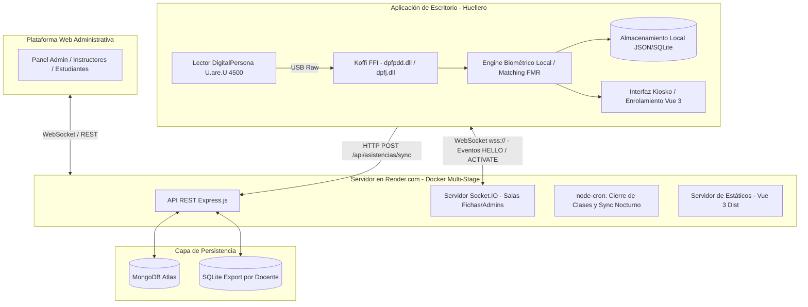

# 📋 Consolidado Técnico Integral: Arquitectura, Cambios y Bugs Resueltos
**Proyecto:** Sistema de Control de Asistencia Biométrico (Huellero SENA / Asista)  
**Fecha de Actualización:** 22 de Septiembre de 2026  
**Ambientes y Tecnologías:** Vue 3 + Quasar (Frontend), Node.js + Express + Socket.IO (Backend), Electron + Koffi FFI + C DLLs DigitalPersona (Desktop), MongoDB Atlas + SQLite (Bases de Datos), Docker en Render.com (Despliegue)

---

## 📑 Tabla de Contenido
1. [Resumen Ejecutivo del Proyecto](#1-resumen-ejecutivo-del-proyecto)
2. [Catálogo de Bugs y Errores Resueltos](#2-catálogo-de-bugs-y-errores-resueltos)
   - [Bug 1: URLs Absolutas con Puerto Cableado en Producción (`ERR_CONNECTION_TIMED_OUT`)](#bug-1-urls-absolutas-con-puerto-cableado-en-producción-err_connection_timed_out)
   - [Bug 2: Bloqueo de Rate-Limiter por Proxy Inverso de Render (`ERR_ERL_UNEXPECTED_X_FORWARDED_FOR`)](#bug-2-bloqueo-de-rate-limiter-por-proxy-inverso-de-render-err_erl_unexpected_x_forwarded_for)
   - [Bug 3: Fallo de Despliegue en Render por Ausencia de SPA Fallback y Build Estático (`ENOENT`)](#bug-3-fallo-de-despliegue-en-render-por-ausencia-de-spa-fallback-y-build-estático-enoent)
   - [Bug 4: Error de Sintaxis por Declaración Duplicada de `path` en Backend](#bug-4-error-de-sintaxis-por-declaración-duplicada-de-path-en-backend)
   - [Bug 5: Atributo Duplicado en Quasar/Vite por Merge Conflict (`mini-to-overlay`)](#bug-5-atributo-duplicado-en-quasarvite-por-merge-conflict-mini-to-overlay)
   - [Bug 6: Incompatibilidad de Vercel Serverless con WebSockets Persistentes](#bug-6-incompatibilidad-de-vercel-serverless-con-websockets-persistentes)
   - [Bug 7: Desconexión del Huellero por Cambio de Computador (`HARDWARE_MISMATCH`)](#bug-7-desconexión-del-huellero-por-cambio-de-computador-hardware_mismatch)
   - [Bug 8: Fallo Silencioso de Captura Física y "Enrolamiento cancelado por fallos consecutivos"](#bug-8-fallo-silencioso-de-captura-física-y-enrolamiento-cancelado-por-fallos-consecutivos)
   - [Bug 9: Botón "Cancelar" Congelado / No Funcional durante el Enrolamiento](#bug-9-botón-cancelar-congelado--no-funcional-durante-el-enrolamiento)
   - [Bug 10: Error Nativo del SDK de DigitalPersona `96075787` (`0x05BA000B` = `DPFPDD_E_FAILURE`)](#bug-10-error-nativo-del-sdk-de-digitalpersona-96075787-0x05ba000b--dpfpdd_e_failure)
   - [Bug 11: Desfase Horario de +5 Horas en Registros de Huella y Asistencia (UTC vs Colombia `America/Bogota`)](#bug-11-desfase-horario-de-5-horas-en-registros-de-huella-y-asistencia-utc-vs-colombia-americabogota)
   - [Bug 12: Comparación Incorrecta y Tardía de Huellas Duplicadas en el Backend](#bug-12-comparación-incorrecta-y-tardía-de-huellas-duplicadas-en-el-backend)
   - [Bug 13: Bloqueo de Smart App Control y Windows Defender en el Instalador `.exe`](#bug-13-bloqueo-de-smart-app-control-y-windows-defender-en-el-instalador-exe)
3. [Registro Cronológico y Temático de Cambios](#3-registro-cronológico-y-temático-de-cambios)
4. [Estado Técnico y Verificaciones de Calidad](#4-estado-técnico-y-verificaciones-de-calidad)
5. [Puntos Pendientes, Deuda Técnica y Recomendaciones a Futuro](#5-puntos-pendientes-deuda-técnica-y-recomendaciones-a-futuro)

---

## 1. Resumen Ejecutivo del Proyecto

### 1.1 Objetivo General
Desarrollar, estabilizar e integrar un **Sistema Integral de Gestión Académica y Control de Asistencia Biométrico** para el Centro de Formación SENA. El sistema permite el enrolamiento dactilar de aprendices mediante lectores ópticos **DigitalPersona U.are.U 4500**, la toma de asistencia en tiempo real supervisada por instructores, la gestión de fichas y excusas, la exportación de bases de datos offline para instructores y el cálculo estricto de horas de inasistencia conforme a las directrices institucionales del SENA.

### 1.2 Arquitectura del Sistema



* **Frontend Web:** Aplicación SPA construida con **Vue 3**, **Vite** y componentes de **Quasar Framework**. Gestiona roles de Administrador, Instructor Líder e Instructor de Apoyo, monitoreo en vivo de clases, reportes consolidados y gestión de aprendices.
* **Backend:** Servidor en **Node.js (ES Modules)** con **Express** para la API REST y **Socket.IO** para el intercambio bidireccional de eventos en tiempo real (activación de lectores, llegada de marcaciones, estados de conexión). Incluye tareas periódicas con **node-cron** (cierre de clases que exceden 3 horas y sincronización nocturna).
* **Desktop (Huellero):** Aplicación de escritorio desarrollada en **Electron** que se ejecuta en las aulas. Se comunica con las librerías dinámicas nativas en C (`dpfpdd.dll` y `dpfj.dll`) mediante **Koffi FFI**. Realiza la identificación biométrica localmente en memoria (comparando contra plantillas cacheadas de la ficha), garantizando funcionamiento ininterrumpido aun en caso de cortes de internet (almacenamiento local en cola y sincronización automática).
* **Bases de Datos:** 
  - **MongoDB Atlas:** Base de datos central para usuarios, fichas, estudiantes, asistencias y dispositivos autorizados.
  - **SQLite:** Bases de datos locales embebidas generadas por docente para auditoría, contingencia y consulta sin conexión.
* **Despliegue:** Arquitectura de servicio único (*Single Service*) mediante un **`Dockerfile` multi-stage** alojado en **Render.com**, optimizado para el plan gratuito y WebSockets continuos.

---

## 2. Catálogo de Bugs y Errores Resueltos

---

### Bug 1: URLs Absolutas con Puerto Cableado en Producción (`ERR_CONNECTION_TIMED_OUT`)
* **Síntoma Exacto:** Al abrir la plataforma web desplegada en la nube (`https://huelleroactualizado-1.onrender.com`), las peticiones a la API (`POST /api/auth/login`) y la conexión de Socket.IO fallaban por timeout intentando conectarse a `https://huelleroactualizado-1.onrender.com:3000/api`.
* **Causa Raíz:** En `frontend/src/services/api.js` y `socket.js`, la URL base concatenaba forzosamente `:3000` al hostname (`${protocol}//${host}:3000`), lo cual sólo era válido en entorno de desarrollo local con Vite independiente. En Render, el tráfico HTTPS viaja por el puerto estándar 443.
* **Solución Implementada:**
  Se modificó la resolución dinámica: si el host no es `localhost:5173` ni un túnel de desarrollo, se utilizan rutas relativas `/api` para Axios y `window.location.origin` para Socket.IO.
* **Archivos Modificados:**
  - [`frontend/src/services/api.js`](file:///c:/Users/JuanC/OneDrive/Desktop/SENA/PROYECTO_FINAL_LECTOR/HuelleroActualizado/frontend/src/services/api.js)
  - [`frontend/src/services/socket.js`](file:///c:/Users/JuanC/OneDrive/Desktop/SENA/PROYECTO_FINAL_LECTOR/HuelleroActualizado/frontend/src/services/socket.js)
  - [`frontend/src/services/index.js`](file:///c:/Users/JuanC/OneDrive/Desktop/SENA/PROYECTO_FINAL_LECTOR/HuelleroActualizado/frontend/src/services/index.js)
* **Commit:** `58b7be2`

---

### Bug 2: Bloqueo de Rate-Limiter por Proxy Inverso de Render (`ERR_ERL_UNEXPECTED_X_FORWARDED_FOR`)
* **Síntoma Exacto:**
  ```text
  ValidationError: The 'X-Forwarded-For' header is set but the Express 'trust proxy' setting is false...
  ```
* **Causa Raíz:** Render utiliza balanceadores de carga y proxies inversos Cloudflare que inyectan el encabezado `X-Forwarded-For`. La librería `express-rate-limit` detectaba este encabezado y bloqueaba las solicitudes por motivos de seguridad al no tener habilitada la confianza de proxy en Express.
* **Solución Implementada:**
  Se configuró la directiva de confianza de proxy en la inicialización de Express:
  ```javascript
  // backend/index.js
  app.set('trust proxy', 1)
  ```
* **Archivo Modificado:** [`backend/index.js`](file:///c:/Users/JuanC/OneDrive/Desktop/SENA/PROYECTO_FINAL_LECTOR/HuelleroActualizado/backend/index.js#L30-L32)
* **Commit:** `38d337b`

---

### Bug 3: Fallo de Despliegue en Render por Ausencia de SPA Fallback y Build Estático (`ENOENT`)
* **Síntoma Exacto:**
  ```text
  Error: ENOENT: no such file or directory, stat '/app/public/index.html'
  ```
  Al recargar cualquier ruta directa distinta a la raíz (ej. `/panel-instructor`, `/dispositivos`), el servidor retornaba 404 o caía.
* **Causa Raíz:** El backend esperaba servir los archivos compilados del frontend desde la carpeta `public/`, pero en Render sólo se ejecutaba `npm start` en la carpeta backend sin haber compilado previamente el código de Vue 3. Además, no existía una ruta de captura comodín (`app.get('*')`) para enrutar las URLs de Vue Router al `index.html`.
* **Solución Implementada:**
  1. Se implementó un **`Dockerfile` multi-stage**: la Etapa 1 compila el frontend con Node.js y Vite; la Etapa 2 copia el resultado (`frontend/dist`) a `backend/public` y levanta el servidor Express.
  2. Se añadió el middleware estático y el fallback para Single Page Application (SPA):
     ```javascript
     app.use(express.static(path.join(__dirname, 'public')))
     app.get('*', (req, res, next) => {
       if (req.path.startsWith('/api') || req.path.startsWith('/socket.io')) return next()
       res.sendFile(path.join(__dirname, 'public', 'index.html'))
     })
     ```
  3. Se crearon los scripts raíz `npm run build:prod` y `scripts/copy-dist.js`.
* **Archivos Modificados:**
  - [`Dockerfile`](file:///c:/Users/JuanC/OneDrive/Desktop/SENA/PROYECTO_FINAL_LECTOR/HuelleroActualizado/Dockerfile)
  - [`backend/index.js`](file:///c:/Users/JuanC/OneDrive/Desktop/SENA/PROYECTO_FINAL_LECTOR/HuelleroActualizado/backend/index.js)
  - [`scripts/copy-dist.js`](file:///c:/Users/JuanC/OneDrive/Desktop/SENA/PROYECTO_FINAL_LECTOR/HuelleroActualizado/scripts/copy-dist.js)
* **Commits:** `15306d1`, `58b7be2`

---

### Bug 4: Error de Sintaxis por Declaración Duplicada de `path` en Backend
* **Síntoma Exacto:**
  ```text
  SyntaxError: Identifier 'path' has already been declared
  ```
* **Causa Raíz:** Se agregó código al final de `backend/index.js` que volvía a importar `import path from 'path'` cuando el módulo ya había sido importado en la cabecera.
* **Solución Implementada:**
  Se limpiaron las importaciones redundantes y se unificaron al inicio del archivo utilizando `fileURLToPath` e `import.meta.url`.
* **Archivo Modificado:** [`backend/index.js`](file:///c:/Users/JuanC/OneDrive/Desktop/SENA/PROYECTO_FINAL_LECTOR/HuelleroActualizado/backend/index.js)

---

### Bug 5: Atributo Duplicado en Quasar/Vite por Merge Conflict (`mini-to-overlay`)
* **Síntoma Exacto:**
  ```text
  [plugin:vite:vue] Duplicate attribute: mini-to-overlay
  file: frontend/src/layouts/DefaultLayout.vue:7:24
  ```
* **Causa Raíz:** Una resolución imperfecta de un conflicto de combinación entre ramas duplicó la directiva `mini-to-overlay` y dejó propiedades contradictorias (`:width="272"` y `:width="290"`) en el `<q-drawer>`.
* **Solución Implementada:**
  Se eliminó el atributo repetido, se fijaron las dimensiones oficiales de diseño (`:width="290"` y `:mini-width="80"`) y se restableció el listener `@click="onSidebarClick"`.
* **Archivo Modificado:** [`frontend/src/layouts/DefaultLayout.vue`](file:///c:/Users/JuanC/OneDrive/Desktop/SENA/PROYECTO_FINAL_LECTOR/HuelleroActualizado/frontend/src/layouts/DefaultLayout.vue)

---

### Bug 6: Incompatibilidad de Vercel Serverless con WebSockets Persistentes
* **Síntoma Exacto:** Los lectores físicos de huella no podían mantener conexión activa; las salas de Socket.IO se cerraban inmediatamente tras la negociación HTTP inicial.
* **Causa Raíz:** Vercel utiliza una arquitectura *Serverless Functions* (AWS Lambda), en la cual las funciones tienen un ciclo de vida efímero (se congelan al retornar la respuesta) y no soportan sockets TCP permanentes ni listeners continuos.
* **Solución Implementada:**
  Se migró la arquitectura hacia un contenedor **Docker persistente en Render.com**, el cual mantiene el proceso de Node.js en ejecución constante, admitiendo Socket.IO y tareas cron en memoria.

---

### Bug 7: Desconexión del Huellero por Cambio de Computador (`HARDWARE_MISMATCH`)
* **Síntoma Exacto:** En el Kiosko del Huellero aparecía el indicador rojo **«Sin conexión»** y el mensaje **«No hay clase activa»**. En la consola de PowerShell se emitía:
  ```text
  [ws-client] HELLO rechazado: HARDWARE_MISMATCH - La identidad de hardware no coincide. Posible copia no autorizada. Contacta al administrador.
  [ws-client] Desconectado (io server disconnect)
  ```
* **Causa Raíz:**
  1. Al cambiar a un PC nuevo, el archivo local [`huellero/config.json`](file:///c:/Users/JuanC/OneDrive/Desktop/SENA/PROYECTO_FINAL_LECTOR/HuelleroActualizado/huellero/config.json) contenía el `deviceId` y `token` registrados originalmente en el equipo anterior.
  2. El mecanismo de seguridad del backend compara el hash del `MachineGuid` de Windows enviado en el `HELLO`. Al no coincidir con el almacenado en la base de datos de MongoDB Atlas, el servidor rechazaba la conexión y desconectaba el socket.
  3. Adicionalmente, en `%APPDATA%\huellero\config.json` existía un archivo residual que apuntaba a `http://127.0.0.1:3000` en lugar de la nube.
* **Solución Implementada:**
  - Se resetearon las credenciales a `null` en ambos archivos de configuración:
    ```json
    {
      "deviceId": null,
      "token": null,
      "backendUrl": "https://huelleroactualizado-1.onrender.com",
      "wsUrl": "wss://huelleroactualizado-1.onrender.com",
      "BIOMETRIC_MATCH_THRESHOLD": 21474
    }
    ```
  - Al reiniciar la app, el método `registrarDispositivoSiNoExiste()` registró el nuevo equipo en Render, quedando en estado `PENDING_APPROVAL`.
  - El administrador aprobó el dispositivo desde la plataforma web y la conexión quedó establecida en verde.
* **Archivos Modificados:**
  - [`huellero/config.json`](file:///c:/Users/JuanC/OneDrive/Desktop/SENA/PROYECTO_FINAL_LECTOR/HuelleroActualizado/huellero/config.json)
  - `C:\Users\JuanC\AppData\Roaming\huellero\config.json`

---

### Bug 8: Fallo Silencioso de Captura Física y "Enrolamiento cancelado por fallos consecutivos"
* **Síntoma Exacto:** Al pulsar "Iniciar captura" en el modal de enrolamiento, la luz del sensor óptico no encendía, la consola no imprimía ningún error y la interfaz cancelaba el enrolamiento en menos de 10 milisegundos indicando:
  ```text
  Enrolamiento cancelado por fallos consecutivos
  ```
* **Causa Raíz:** En `huellero/src/main/engine.js`, la función `enrolarEstudiante()` ejecutaba un bucle `while (true)` con un bloque `try/catch` que atrapaba cualquier fallo de hardware (ej. dispositivo no encontrado o bloqueado) e incrementaba `fallosConsecutivos++`. Al llegar a 3 fallos consecutivos, cancelaba el proceso **sin emitir ningún `console.error`**, enmascarando completamente la causa de la falla.
* **Solución Implementada:**
  - Se incorporó trazabilidad detallada con prefijo `[capture]` y `[engine]` en [`capture.js`](file:///c:/Users/JuanC/OneDrive/Desktop/SENA/PROYECTO_FINAL_LECTOR/HuelleroActualizado/huellero/src/main/capture.js) y [`engine.js`](file:///c:/Users/JuanC/OneDrive/Desktop/SENA/PROYECTO_FINAL_LECTOR/HuelleroActualizado/huellero/src/main/engine.js).
  - Se registraron los códigos de retorno y estados de `dpfpdd_query_devices()`, `dpfpdd_open()` y `dpfpdd_capture()`.
  - Se documentó el flujo en [`docs/DIAGNOSTICO_CAPTURA_HUELLERO.md`](file:///c:/Users/JuanC/OneDrive/Desktop/SENA/PROYECTO_FINAL_LECTOR/HuelleroActualizado/docs/DIAGNOSTICO_CAPTURA_HUELLERO.md).
* **Archivos Modificados:**
  - [`huellero/src/main/capture.js`](file:///c:/Users/JuanC/OneDrive/Desktop/SENA/PROYECTO_FINAL_LECTOR/HuelleroActualizado/huellero/src/main/capture.js)
  - [`huellero/src/main/engine.js`](file:///c:/Users/JuanC/OneDrive/Desktop/SENA/PROYECTO_FINAL_LECTOR/HuelleroActualizado/huellero/src/main/engine.js)
* **Commit:** `b343c3a`

---

### Bug 9: Botón "Cancelar" Congelado / No Funcional durante el Enrolamiento
* **Síntoma Exacto:** Al iniciar el enrolamiento de un aprendiz, presionar el botón "Cancelar" en la interfaz no detenía la operación; el botón parecía congelado y el modal continuaba esperando la huella.
* **Causa Raíz:** 
  1. `cancelarEnrolamiento()` únicamente asignaba una bandera booleana en memoria (`enrolamientoCancelado = true`), pero no invocaba la cancelación de la llamada nativa asíncrona a Koffi (`cancelarCapturaEnCurso()`).
  2. Si la captura fallaba, el `catch` de `engine.js` sumaba fallos e ignoraba si el usuario había solicitado la cancelación manualmente.
  3. En el renderer Vue, el botón no actualizaba inmediatamente el estado de la vista (`estadoCaptura.value`).
* **Solución Implementada:**
  - En [`huellero/src/main/engine.js`](file:///c:/Users/JuanC/OneDrive/Desktop/SENA/PROYECTO_FINAL_LECTOR/HuelleroActualizado/huellero/src/main/engine.js), `cancelarEnrolamiento()` ahora invoca inmediatamente `cancelarCapturaEnCurso()`, interrumpiendo el descriptor nativo.
  - En el `catch`, se verifica `if (enrolamientoCancelado)` para abortar de inmediato sin sumar reintentos.
  - En [`EnrolarHuellaModal.vue`](file:///c:/Users/JuanC/OneDrive/Desktop/SENA/PROYECTO_FINAL_LECTOR/HuelleroActualizado/huellero/src/renderer/src/views/EnrolarHuellaModal.vue), `cancelar()` conmuta instantáneamente `estadoCaptura.value = 'idle'`.
* **Archivos Modificados:**
  - [`huellero/src/main/engine.js`](file:///c:/Users/JuanC/OneDrive/Desktop/SENA/PROYECTO_FINAL_LECTOR/HuelleroActualizado/huellero/src/main/engine.js#L33-L37)
  - [`huellero/src/renderer/src/views/EnrolarHuellaModal.vue`](file:///c:/Users/JuanC/OneDrive/Desktop/SENA/PROYECTO_FINAL_LECTOR/HuelleroActualizado/huellero/src/renderer/src/views/EnrolarHuellaModal.vue#L214-L218)
* **Commit:** `b343c3a`

---

### Bug 10: Error Nativo del SDK de DigitalPersona `96075787` (`0x05BA000B` = `DPFPDD_E_FAILURE`)
* **Síntoma Exacto:** Al llamar a la función de enumeración USB `dpfpdd_query_devices()`, la librería retornaba el código numérico decimal `96075787` (`0x05BA000B`).
* **Causa Raíz:** Se investigaron las cabeceras C oficiales del SDK en [`docs/sdk-reference/dpfpdd.h`](file:///c:/Users/JuanC/OneDrive/Desktop/SENA/PROYECTO_FINAL_LECTOR/HuelleroActualizado/docs/sdk-reference/dpfpdd.h). El código corresponde a:
  ```c
  #define _DP_FACILITY  0x05BA
  #define DPERROR(err)  ((int)err | (_DP_FACILITY << 16))
  #define DPFPDD_E_FAILURE  DPERROR(0x0b) // 0x05BA000B = 96075787
  ```
  La definición oficial estipula *"Unspecified failure / Unexpected failure"*. En un equipo recién formateado, este error surge cuando Windows Update instala un controlador genérico WBF en lugar del **DigitalPersona RTE Driver**, o cuando el servicio `DpHost` bloquea el bus USB en modo exclusivo.
* **Solución Implementada:**
  - Creación del documento técnico de referencia [`docs/CODIGO_ERROR_DPFPDD_05BA000B.md`](file:///c:/Users/JuanC/OneDrive/Desktop/SENA/PROYECTO_FINAL_LECTOR/HuelleroActualizado/docs/CODIGO_ERROR_DPFPDD_05BA000B.md).
  - Guía de verificación de servicios en Windows (`services.msc`) e instalación del driver RTE sin WBF.
* **Commit:** `1efe66d`

---

### Bug 11: Desfase Horario de +5 Horas en Registros de Huella y Asistencia (UTC vs Colombia `America/Bogota`)
* **Síntoma Exacto:** Una marcación realizada aproximadamente a las **9:00 PM (21:00)** en Colombia quedaba registrada en la base de datos y en la interfaz como las **2:00 AM** del día siguiente.
* **Causa Raíz:**
  1. Render ejecuta sus contenedores Linux bajo la zona horaria **UTC (GMT+0)**. Colombia se encuentra en **UTC-5**.
  2. En `backend/controllers/asistenciaController.js`, la hora y fecha se calculaban con:
     ```javascript
     const fecha = new Date(dateObj.getTime() - offsetMs).toISOString().split('T')[0]
     const hora = dateObj.toTimeString().slice(0, 8)
     ```
     Al ser `offsetMs === 0` en el servidor, `toTimeString()` formateaba la hora UTC (+5 horas). Después de las 7:00 PM (hora Colombia), la fecha quedaba asignada al día siguiente y el motor de tardanzas comparaba erróneamente contra la madrugada.
* **Solución Implementada:**
  1. Configuración de la variable de entorno `TZ` en Docker y Node.js:
     ```dockerfile
     ENV TZ=America/Bogota
     ```
     ```javascript
     process.env.TZ = process.env.TZ || 'America/Bogota'
     ```
  2. Uso estricto de `Intl.DateTimeFormat` configurado para `America/Bogota` en la generación de fechas y horas (`getHoyString()`, `formatearFechaColombia()`, `formatearHoraColombia()`).
  3. Extracción de horas y minutos en horario colombiano para el cálculo de tardanzas escalonadas (`calcularTardanzaEscalonada`).
  4. Configuración de `{ timezone: 'America/Bogota' }` en los cron jobs nocturnos de SQLite.
* **Archivos Modificados:**
  - [`Dockerfile`](file:///c:/Users/JuanC/OneDrive/Desktop/SENA/PROYECTO_FINAL_LECTOR/HuelleroActualizado/Dockerfile#L37-L38)
  - [`backend/Dockerfile`](file:///c:/Users/JuanC/OneDrive/Desktop/SENA/PROYECTO_FINAL_LECTOR/HuelleroActualizado/backend/Dockerfile#L11)
  - [`backend/index.js`](file:///c:/Users/JuanC/OneDrive/Desktop/SENA/PROYECTO_FINAL_LECTOR/HuelleroActualizado/backend/index.js#L1)
  - [`backend/services/asistenciaService.js`](file:///c:/Users/JuanC/OneDrive/Desktop/SENA/PROYECTO_FINAL_LECTOR/HuelleroActualizado/backend/services/asistenciaService.js)
  - [`backend/controllers/asistenciaController.js`](file:///c:/Users/JuanC/OneDrive/Desktop/SENA/PROYECTO_FINAL_LECTOR/HuelleroActualizado/backend/controllers/asistenciaController.js)
  - [`backend/controllers/enrolamientoController.js`](file:///c:/Users/JuanC/OneDrive/Desktop/SENA/PROYECTO_FINAL_LECTOR/HuelleroActualizado/backend/controllers/enrolamientoController.js)
  - [`backend/services/cronService.js`](file:///c:/Users/JuanC/OneDrive/Desktop/SENA/PROYECTO_FINAL_LECTOR/HuelleroActualizado/backend/services/cronService.js)
* **Commit:** `1efe66d`

---

### Bug 12: Comparación Incorrecta y Tardía de Huellas Duplicadas en el Backend
* **Síntoma Exacto:** Al enrolar una huella, el backend ejecutaba una consulta `Estudiante.findOne` que rechazaba el guardado simplemente si existía otro estudiante enrolado, sin comparar las minucias biométricas reales de la plantilla.
* **Causa Raíz:** El backend de Node.js no posee las librerías binarias nativas C de DigitalPersona (`dpfj.dll`) que permiten calcular el FMR (*False Match Rate*). Dicha validación biométrica no pertenecía a la capa web.
* **Solución Implementada:**
  - Se eliminó la validación heurística del backend en `enrolamientoController.js`.
  - Se trasladó la validación estricta al proceso local del Huellero (`engine.js`), ejecutando `fingerprint.checkDuplicateFingerprint` contra todas las plantillas cacheadas antes de enviar el template al servidor. Si existe coincidencia matemática, la app desktop notifica: *"Esta huella ya está registrada a nombre de [Nombre Aprendiz]"*.
* **Archivos Modificados:**
  - [`backend/controllers/enrolamientoController.js`](file:///c:/Users/JuanC/OneDrive/Desktop/SENA/PROYECTO_FINAL_LECTOR/HuelleroActualizado/backend/controllers/enrolamientoController.js)
  - [`huellero/src/main/engine.js`](file:///c:/Users/JuanC/OneDrive/Desktop/SENA/PROYECTO_FINAL_LECTOR/HuelleroActualizado/huellero/src/main/engine.js)
* **Commit:** `4424df1`

---

### Bug 13: Bloqueo de Smart App Control y Windows Defender en el Instalador `.exe`
* **Síntoma Exacto:** Al compilar el instalador con `electron-builder` (`Huellero SENA Setup 1.0.0.exe`) y ejecutarlo en Windows 11, el sistema operativo impedía la apertura con el mensaje: *«Smart App Control bloqueó esta aplicación porque no tiene una firma válida»*.
* **Causa Raíz:** Microsoft exige certificados de firma digital comerciales (EV Code Signing) para permitir la instalación directa de binarios generados fuera de la Microsoft Store sin alertas de SmartScreen.
* **Solución Implementada:**
  - Se estableció el procedimiento de exclusión temporal en Windows Security para el entorno interno del SENA.
  - Se configuró la distribución directa de la carpeta desempaquetada portable `huellero/release-app/win-unpacked` para pruebas inmediatas en laboratorio sin requerir elevación NSIS.

---

### Bug 14: Fuga de Asistencias Globales en el Portal del Aprendiz (`estudianteId` ignorado en Backend)
* **Síntoma Exacto:** Al ingresar al portal del estudiante (ej: perfil de Juan Camilo Viviescas), aparecían acumuladas **104 horas de inasistencia (26 faltas)** y la misma fecha (`2026-09-19`) repetida 25 veces en la tabla personal de asistencias, a pesar de que el aprendiz solo tenía 1 falta y 2 asistencias reales.
* **Causa Raíz:** En `backend/controllers/asistenciaController.js`, la función `getAsistencias` solo extraía de `req.query` los parámetros `fichaId`, `fecha`, `fechaDesde` y `fechaHasta`, **ignorando por completo `estudianteId`**. Cuando el frontend invocaba `api.asistencias.getAll({ estudianteId: ... })`, el backend devolvía las 32 asistencias de toda la institución sin filtrar. Además, el componente Vue no filtraba defensivamente los registros recibidos, sumando las fallas de todos los demás compañeros de la ficha a la cuenta del estudiante en sesión.
* **Solución Implementada:**
  - En `backend/controllers/asistenciaController.js`, se añadió el soporte para `estudianteId` en `req.query`:
    ```javascript
    const { fichaId, estudianteId, fecha, fechaDesde, fechaHasta } = req.query
    if (estudianteId) filter.estudianteId = estudianteId
    ```
  - En `frontend/src/views/PanelEstudiante.vue`, `frontend/src/components/PanelEstudiante.vue` y `frontend/src/components/ConsultaEstudiante.vue`, se agregó un filtro defensivo por `estudianteId` antes de poblar la tabla y calcular horas.
  - Verificación: La consulta para Juan Camilo Viviescas ahora retorna únicamente sus 3 registros reales (2 Presentes, 1 Falta = 4 horas ausente en lugar de 104 horas).
* **Archivos Modificados:**
  - [`backend/controllers/asistenciaController.js`](file:///c:/Users/JuanC/OneDrive/Desktop/SENA/PROYECTO_FINAL_LECTOR/HuelleroActualizado/backend/controllers/asistenciaController.js#L17-L24)
  - [`frontend/src/views/PanelEstudiante.vue`](file:///c:/Users/JuanC/OneDrive/Desktop/SENA/PROYECTO_FINAL_LECTOR/HuelleroActualizado/frontend/src/views/PanelEstudiante.vue#L43-L45)
  - [`frontend/src/components/PanelEstudiante.vue`](file:///c:/Users/JuanC/OneDrive/Desktop/SENA/PROYECTO_FINAL_LECTOR/HuelleroActualizado/frontend/src/components/PanelEstudiante.vue#L51-L53)
  - [`frontend/src/components/ConsultaEstudiante.vue`](file:///c:/Users/JuanC/OneDrive/Desktop/SENA/PROYECTO_FINAL_LECTOR/HuelleroActualizado/frontend/src/components/ConsultaEstudiante.vue#L40-L44)

---

## 3. Registro Cronológico y Temático de Cambios

### 3.1 Nuevas Funcionalidades
1. **Eliminación Definitiva de Dispositivos (`eliminarDispositivo`):**
   - Incorporación de botón con icono de papelera y alerta de confirmación en el Panel de Dispositivos (tanto para equipos activos como deshabilitados).
   - En el backend, al eliminar un dispositivo se desconecta de inmediato su socket activo (`desconectarDispositivo(deviceId)`) y se actualizan a `null` las fichas que lo tenían vinculado como hardware de asistencia.
   - *Commits:* `ec8c57d`, `cac939f`.
2. **Consentimiento de Tratamiento de Datos Personales (Ley 1581 de 2012):**
   - Modal bloqueante en el Huellero antes de permitir el primer enrolamiento dactilar.
   - Modelo `PermisoDatosPersonales` y endpoints de auditoría en backend.
3. **Cálculo Escalonado de Tardanzas por Horas:**
   - Normalización de reglas: 0-5 min (Presente), 5-65 min (Tardanza 1h), 65-125 min (Tardanza 2h), >125 min (Falta).
   - Acumulación en banco de horas de inasistencia (cada 6 horas = 1 día de falla).
4. **Exportación y Sincronización Nocturna por Docente:**
   - Generación de archivos SQLite independientes por instructor a la medianoche con los últimos 3 días hábiles (considerando días festivos institucionales).

### 3.2 Refactorizaciones y UI/UX
1. **Rediseño del Sidebar Principal:**
   - Tema institucional SENA en verde `#007832`, eliminación de sombras pesadas, logotipo vectorial nítido de 48px y estado reactivo para nombre de usuario conectado.
   - Estados mini (80px) y expandido (290px) con colapso fluido.
2. **Control de Acceso por Roles (RBAC):**
   - Meta-atributo `soloLider: true` en el router de Vue para restringir funciones críticas (ej. importación masiva de aprendices) a los instructores líderes de la ficha.

### 3.3 Configuración, Despliegue y Seguridad
1. **Adopción de Arquitectura Single-Service en Docker:**
   - Migración exitosa a `Dockerfile` con multi-stage build en Render.com.
2. **Configuración de Zona Horaria Oficial:**
   - Configuración global `America/Bogota` en contenedores y servicios para eliminar desajustes UTC.
3. **Optimización de Índices en MongoDB:**
   - Índice único compuesto `{ estudianteId: 1, fichaId: 1, fecha: 1 }` en `Asistencia` para erradicar condiciones de carrera en marcaciones concurrentes.
   - Índice parcial único `{ deviceId: 1 }` con filtro `{ estado: 'Activa' }` en `Clase`.

---

## 4. Estado Técnico y Verificaciones de Calidad

### 4.1 Estado de Git y Ramas
* **Rama Principal:** `main`
* **Remotos Sincronizados:**
  - `origin` / `asista`: `https://github.com/JuanViviescas00/Asista.git` (conectado al despliegue automático de Render).
  - `juan`: `https://github.com/ivanrene86/HuelleroActualizado.git` (repositorio central del proyecto formativo).
* **Estado del Árbol de Trabajo:** Limpio (`working tree clean`).

### 4.2 Resultados de Compilación Reales

| Módulo | Comando | Tiempo de Compilación | Estado | Métricas del Bundle |
|---|---|---|---|---|
| **Frontend Web** | `npm run build:frontend` | 581 ms | ✅ Exitoso | `index.html` (0.96 kB), `index.js` (838 kB / 260 kB gzip), `index.css` (313 kB) |
| **Pipeline Producción** | `npm run build:prod` | 813 ms | ✅ Exitoso | Compilación + copia íntegra de assets a `backend/public/` |
| **Desktop Huellero (Main/Preload)** | `npm run build --prefix huellero` | 185 ms | ✅ Exitoso | SSR bundle Node/Electron generado en `huellero/out/main/index.js` (66.9 kB) |
| **Desktop Huellero (Renderer)** | `npm run build --prefix huellero` | 586 ms | ✅ Exitoso | SPA Kiosko generada en `huellero/out/renderer/` (264 kB JS / 19.8 kB CSS) |
| **Backend Node.js** | `node --check ...` | < 100 ms | ✅ Exitoso | Validación de sintaxis en todos los controladores y servicios sin errores |

### 4.3 Verificación de Endpoints y Flujos Críticos
* **`POST /api/auth/login`:** Emisión de JWT y filtrado de perfil/rol verificado.
* **`POST /api/asistencias/sync`:** Inserción idempotente mediante `uuid` e índice único de concurrencia verificado.
* **WebSocket Handshake (`HELLO`):** Validación de `deviceId`, `tokenHash` (bcrypt) y `hardwareFingerprintHash` (SHA-256) verificado.
* **Auto-cierre de Clases:** Verificación del job cron con filtro `iniciadaAt <= 3h` y emisión de `DEACTIVATE`.

---

## 5. Puntos Pendientes, Deuda Técnica y Recomendaciones a Futuro

1. **Firma Digital de Código (Code Signing Certificate):**
   * *Diagnóstico:* En entornos productivos Windows fuera de laboratorios de prueba, SmartScreen alertará sobre instaladores generados sin certificado de firma de código comercial (EV o Sectigo).
   * *Recomendación:* Adquirir un certificado de firma de código o instruir la distribución mediante política de grupo (GPO) interna del SENA.
2. **Optimización de Chunks en el Frontend Web (Code-Splitting):**
   * *Diagnóstico:* El chunk principal `dist/assets/index-Ch1fwOvN.js` pesa 838 kB, lo que genera una advertencia en Vite (`(!) Some chunks are larger than 500 kB`).
   * *Recomendación:* Configurar `build.rollupOptions.output.manualChunks` en `frontend/vite.config.js` para separar dependencias pesadas (ej. Quasar, Chart.js, XLSX) en chunks diferidos cargados bajo demanda vía `import()`.
3. **Manejo del Spin-Down en el Plan Gratuito de Render:**
   * *Diagnóstico:* Tras 15 minutos de inactividad, Render suspende el contenedor gratuito, tomando entre 50 y 90 segundos en responder a la primera petición.
   * *Recomendación:* Mantener activo un servicio ping/uptime ligero (ej. Cron Job externo contra `/api/health`) o migrar al plan Render Individual ($7/mes) si se requiere disponibilidad inmediata en horarios de clase.
4. **Estrategia de Purga y Backup de Bases de Datos SQLite:**
   * *Diagnóstico:* La carpeta `backend/data/` acumula archivos SQLite por docente de manera indefinida.
   * *Recomendación:* Implementar un script de retención que archive o elimine bases de datos con más de 90 días de antigüedad para no saturar el almacenamiento efímero del contenedor.
