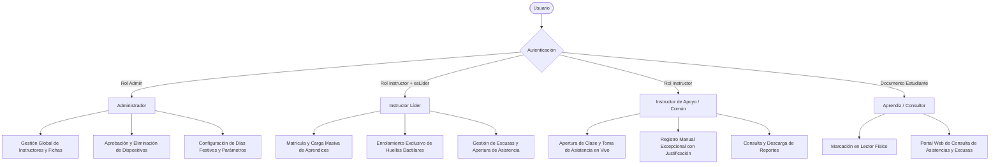

# ESPECIFICACIÓN TÉCNICA DE REQUERIMIENTOS Y ESTADO DE IMPLEMENTACIÓN (AVANCE: 90%)
## Sistema Integral de Control de Asistencia y Gestión Académica Biométrica (Huellero SENA / Asista)

---

**Entidad:** Servicio Nacional de Aprendizaje (SENA)  
**Centro de Formación:** Centro de Servicios y Gestión Empresarial / Formación Tecnológica  
**Documento Base:** *Especificación Técnica de Requerimientos_ Sistema de Asistencia Biométrica (1).docx*  
**Versión de la Especificación:** 2.0 (Consolidada con Estado de Implementación al 90%)  
**Fecha:** Septiembre de 2026  
**Autores y Equipo de Desarrollo:** Juan Camilo Viviescas, María Julia Saavedra, César, Óscar, Iván René  
**Stack Tecnológico:** Vue 3 + Quasar (Frontend), Node.js + Express + Socket.IO (Backend), Electron + Koffi FFI + C DLLs DigitalPersona (Desktop), MongoDB Atlas + SQLite (Bases de Datos), Docker en Render.com (Despliegue)

---

## 📑 TABLA DE CONTENIDO
1. [Información General y Justificación Técnica](#1-información-general-y-justificación-técnica)
2. [Estructura de Roles y Matriz de Permisos (RBAC)](#2-estructura-de-roles-y-matriz-de-permisos-rbac)
3. [Especificación y Matriz de Requerimientos Funcionales (RF-001 al RF-036)](#3-especificación-y-matriz-de-requerimientos-funcionales-rf-001-al-rf-036)
4. [Especificación y Verificación de Requerimientos No Funcionales (RNF-001 al RNF-011)](#4-especificación-y-verificación-de-requerimientos-no-funcionales-rnf-001-al-rnf-011)
5. [Arquitectura Técnica, Infraestructura y Protocolos de Comunicación](#5-arquitectura-técnica-infraestructura-y-protocolos-de-comunicación)
6. [Catálogo de Errores y Ajustes de Hardware Resueltos durante el Desarrollo](#6-catálogo-de-errores-y-ajustes-de-hardware-resueltos-durante-el-desarrollo)
7. [Balance de Avance (90%) y Hoja de Ruta al Cierre del 100%](#7-balance-de-avance-90-y-hoja-de-ruta-al-cierre-del-100)

---

## 1. INFORMACIÓN GENERAL Y JUSTIFICACIÓN TÉCNICA

### 1.1. Propósito y Alcance
El presente documento consolida la especificación técnica formal, arquitectura y matriz de verificación del **Sistema de Asistencia Biométrica Institucional**. El software automatiza la captura, validación y consolidación de la asistencia de los aprendices del SENA en tiempo real, garantizando:
* Reducción a cero del fraude o suplantación en el registro de asistencia.
* Cálculo riguroso de horas de tardanza y banco de horas acumuladas de inasistencia (reglamento del aprendiz).
* Operación continua aun bajo caídas del servicio de internet en las aulas mediante almacenamiento local y sincronización diferida (*Offline-First*).
* Pleno cumplimiento de la legislación colombiana sobre protección de datos personales (**Ley 1581 de 2012 - Habeas Data**).

### 1.2. Justificación Técnica del Lector DigitalPersona U.are.U 4500
La elección del lector óptico **DigitalPersona U.are.U 4500** responde a los siguientes factores arquitectónicos y operativos:
1. **Identificación Biométrica Automática (1:N en Memoria):** El aprendiz simplemente coloca su dedo sobre el cristal del sensor. El motor biométrico nativo (*FingerJet Engine*) compara la minucia contra todas las plantillas activas de la ficha en **menos de 1 segundo**, sin necesidad de ingresar cédula o seleccionar el nombre en pantalla.
2. **Retroalimentación Visual (LEDs integrados):** El sensor emite iluminación LED azul tenue en reposo, parpadeo azul intenso de confirmación ante captura exitosa y destellos de alerta ante lecturas defectuosas.
3. **Mapeo de Minucias Matemáticas (ISO/IEC 19794-2):** El sistema **no almacena ni transmite fotos o imágenes de huellas**. Únicamente genera y cifra un vector matemático unidireccional (*Fingerprint Template*), irreversible a la imagen de origen.
4. **Interconexión Nativa de Bajo Nivel:** Uso de la librería de bindings **Koffi FFI** en el proceso principal de Electron, cargando directamente las DLLs nativas de 64 bits del fabricante (`dpfpdd.dll` para adquisición y `dpfj.dll` para conversión/comparación).

---

## 2. ESTRUCTURA DE ROLES Y MATRIZ DE PERMISOS (RBAC)

El sistema opera bajo cuatro roles de usuario claramente delimitados y validados tanto en el cliente (Vue Router) como en el backend (middlewares JWT):



### Matriz de Acceso por Módulo y Roles

| Módulo / Funcionalidad | Administrador | Instructor Líder | Instructor Común | Aprendiz |
|---|:---:|:---:|:---:|:---:|
| **Gestión de Instructores** | ✅ Total | ❌ | ❌ | ❌ |
| **Gestión de Fichas Académicas** | ✅ Total | 👁️ Lectura | 👁️ Lectura | ❌ |
| **Gestión y Registro de Dispositivos (Huelleros)** | ✅ Total (Aprobar / Eliminar) | ❌ | ❌ | ❌ |
| **Matrícula Individual de Aprendices** | ✅ Total | ✅ Ficha asignada | ❌ | ❌ |
| **Carga Masiva de Aprendices (.csv / .xlsx)** | ✅ Total | ✅ Ficha asignada | ❌ | ❌ |
| **Enrolamiento Biométrico (Captura de Huella)** | ❌ (Delegado) | ✅ Exclusivo de su ficha | ❌ | ❌ |
| **Apertura y Monitoreo de Clase en Vivo** | ✅ | ✅ Ficha asignada | ✅ Ficha asignada | ❌ |
| **Registro Manual de Asistencia (Falla Física)** | ✅ | ✅ | ✅ | ❌ |
| **Gestión y Aprobación de Excusas** | ✅ Total | ✅ Ficha asignada | ✅ Ficha asignada | ❌ |
| **Días Festivos y No Lectivos** | ✅ Total | 👁️ Lectura | 👁️ Lectura | ❌ |
| **Descarga de Reportes (Excel / PDF / SQLite)** | ✅ Consolidado | ✅ Por Ficha | ✅ Por Ficha | ❌ |
| **Portal de Consulta de Asistencia Personal** | ❌ | ❌ | ❌ | ✅ Exclusivo |

---

## 3. ESPECIFICACIÓN Y MATRIZ DE REQUERIMIENTOS FUNCIONALES (RF-001 AL RF-036)

### 3.1. Módulo de Autenticación, Seguridad y Sesiones

#### RF-001: Registro de Instructores
* **Rol:** Administrador.
* **Campos:** `nombres`, `apellidos`, `tipoDocumento` (CC/CE/PEP), `numeroDocumento`, `correo`, `telefono`, `especialidad`, `rolDetallado`.
* **Comportamiento:** Crea el perfil de instructor en MongoDB Atlas y cifra la contraseña temporal inicial con `bcryptjs`.
* **Implementación:** `backend/controllers/instructorController.js` (`POST /api/instructores`).
* **Estado:** ✅ **100% Implementado y Verificado.**

#### RF-002: Inicio de Sesión
* **Rol:** Administrador / Instructor.
* **Campos:** `correo`, `password`.
* **Comportamiento:** Valida credenciales, comprueba estado activo y genera token JWT firmado (duración 8 horas) con claims de rol y permisos.
* **Implementación:** `backend/controllers/authController.js` (`POST /api/auth/login`).
* **Estado:** ✅ **100% Implementado y Verificado.**

#### RF-003: Recuperación de Contraseña
* **Rol:** Instructor / Administrador.
* **Campos:** `correo`.
* **Comportamiento:** Emite token temporal criptográfico firmado mediante `nodemailer` al correo institucional para restablecimiento seguro.
* **Implementación:** `backend/controllers/authController.js`, `backend/services/emailService.js`.
* **Estado:** ✅ **100% Implementado y Verificado.**

#### RF-004: Cierre de Sesión Manual
* **Rol:** Todos los usuarios autenticados.
* **Comportamiento:** Revocación de sesión local en el cliente Vue (eliminación de JWT en `localStorage`) y desconexión de la sala en Socket.IO.
* **Implementación:** `frontend/src/composables/useAuth.js`.
* **Estado:** ✅ **100% Implementado y Verificado.**

#### RF-025: Cierre Automático por Inactividad
* **Rol:** Sistema / Frontend.
* **Comportamiento:** Monitoreo de eventos de teclado y ratón; expirada la ventana de inactividad, cierra sesión y redirige a `/login`.
* **Implementación:** `frontend/src/App.vue`.
* **Estado:** ✅ **100% Implementado y Verificado.**

#### RF-027: Cambio de Contraseña
* **Rol:** Usuario autenticado.
* **Campos:** `passwordActual`, `nuevoPassword`, `confirmacion`.
* **Comportamiento:** Comprueba la clave actual contra el hash de MongoDB y actualiza con nuevo salt de 10 rondas.
* **Implementación:** `backend/controllers/authController.js` (`PUT /api/auth/cambiar-password`).
* **Estado:** ✅ **100% Implementado y Verificado.**

#### RF-029: Desactivación de Cuentas
* **Rol:** Administrador.
* **Campos:** `id`, `estado` (`Inactivo`), `motivo`.
* **Comportamiento:** Suspende el acceso inmediato del docente revocando sesiones futuras sin destruir el histórico de clases impartidas.
* **Implementación:** `backend/controllers/instructorController.js` (`PUT /api/instructores/:id/estado`).
* **Estado:** ✅ **100% Implementado y Verificado.**

---

### 3.2. Módulo de Gestión Institucional, Fichas y Usuarios

#### RF-005: Registro de Estudiantes
* **Rol:** Instructor Líder / Administrador.
* **Campos:** `nombres`, `apellidos`, `tipoDocumento`, `numeroDocumento`, `genero`, `correo`, `telefono`, `fichaId`, `estado` (`Activo`).
* **Comportamiento:** Registra aprendices vinculados directamente a la ficha que lidera el instructor.
* **Implementación:** `backend/controllers/estudianteController.js` (`POST /api/estudiantes`).
* **Estado:** ✅ **100% Implementado y Verificado.**

#### RF-006: Edición de Datos de Estudiante
* **Rol:** Instructor Líder.
* **Campos Modificables:** `nombres`, `apellidos`, `genero`, `correo`, `telefono`, `estado`.
* **Comportamiento:** Actualización de datos manteniendo inmutable el historial previo de asistencias.
* **Implementación:** `backend/controllers/estudianteController.js` (`PUT /api/estudiantes/:id`).
* **Estado:** ✅ **100% Implementado y Verificado.**

#### RF-007: Desactivación / Inhabilitación de Aprendices
* **Rol:** Administrador / Instructor Líder.
* **Campos:** `estudianteId`, `estado` (`Inactivo` / `Retirado`), `motivo`.
* **Comportamiento:** El aprendiz inactivo no aparece en las listas de asistencia activa ni puede marcar en el huellero.
* **Implementación:** `backend/controllers/estudianteController.js`.
* **Estado:** ✅ **100% Implementado y Verificado.**

#### RF-008: Listados, Búsquedas y Filtros
* **Rol:** Docente / Administrador.
* **Criterios:** Búsqueda por documento, nombres, ficha, jornada y estado de asistencia.
* **Implementación:** `frontend/src/views/Estudiantes.vue`, `frontend/src/views/Fichas.vue`.
* **Estado:** ✅ **100% Implementado y Verificado.**

#### RF-011: Gestión de Fichas, Programas y Horarios
* **Rol:** Administrador.
* **Campos:** `codigoFicha`, `nombrePrograma`, `jornada` (Mañana / Tarde / Noche), `dispositivoId`, `instructorLiderId`.
* **Comportamiento:** Asocia el grupo académico con el instructor líder y con el dispositivo físico (huellero) asignado al aula.
* **Implementación:** `backend/controllers/fichaController.js`, `frontend/src/views/Fichas.vue`.
* **Estado:** ✅ **100% Implementado y Verificado.**

#### RF-035: Consulta Rápida en Lector (Kiosko)
* **Rol:** Docente / Aprendiz.
* **Comportamiento:** Permite verificar rápidamente en pantalla si el estudiante se encuentra matriculado en la ficha activa.
* **Implementación:** `huellero/src/renderer/src/views/KioskoView.vue`.
* **Estado:** ✅ **100% Implementado y Verificado.**

#### RF-036: Carga Masiva de Usuarios (Excel / CSV)
* **Rol:** Administrador / Instructor Líder (validado con `soloLider: true`).
* **Campos:** Archivo con cabeceras estándar de documento, nombres, correo, teléfono y ficha.
* **Comportamiento:** Parser de archivos `.csv` y `.xlsx`, procesamiento por lotes con reporte detallado de filas exitosas y errores. Preserva datos preexistentes.
* **Implementación:** `backend/controllers/estudianteController.js` (`POST /api/estudiantes/carga-masiva`), `frontend/src/views/ImportarUsuarios.vue`.
* **Estado:** ✅ **100% Implementado y Verificado.**

---

### 3.3. Módulo de Motor Biométrico y Control de Asistencia Automática

#### RF-012: Registro Manual Excepcional
* **Rol:** Instructor de la clase.
* **Campos:** `estudianteId`, `fichaId`, `fecha`, `hora`, `estado` (`Presente`), `metodo` (`MANUAL`), `observacion`.
* **Comportamiento:** Permite marcar asistencia cuando el estudiante presenta vendajes, laceraciones o fallas dactilares.
* **Implementación:** `backend/controllers/asistenciaController.js` (`POST /api/asistencias`).
* **Estado:** ✅ **100% Implementado y Verificado.**

#### RF-013: Enrolamiento Biométrico (Validación de 3 Muestras)
* **Rol:** Instructor Líder (Exclusivo).
* **Campos:** `estudianteId`, `dedo`, `template` (minucias base64), `slot` (1 o 2), `consentimientoHabeasData` (true).
* **Comportamiento:** 
  1. Muestra modal bloqueante de consentimiento de tratamiento de datos personales (**Ley 1581 de 2012**).
  2. Solicita colocar el dedo 3 veces consecutivas para consolidar la plantilla mediante `dpfj_create_enrollment_fmd()`.
  3. Comprueba localmente que la huella no pertenezca ya a otro estudiante registrado (`checkDuplicateFingerprint`).
  4. Guarda la plantilla en MongoDB y en la caché del huellero.
* **Implementación:** `huellero/src/main/engine.js`, `huellero/src/renderer/src/views/EnrolarHuellaModal.vue`.
* **Estado:** ✅ **100% Implementado y Verificado.**

#### RF-014: Registro y Validación Automática (1:N)
* **Rol:** Sistema / Motor Biométrico.
* **Comportamiento:** Al poner el dedo en el sensor óptico, `capturarHuella()` obtiene la imagen raw (500 DPI), extrae la plantilla con `dpfj_create_fmd_from_raw()` y la compara contra las plantillas cacheadas en memoria mediante `dpfj_compare()` con umbral `BIOMETRIC_MATCH_THRESHOLD = 21474`.
* **Implementación:** `huellero/src/main/engine.js` (`capturarYVerificar()`), `huellero/src/fingerprint.js`.
* **Estado:** ✅ **100% Implementado y Verificado.**

#### RF-016: Control de Duplicidad de Marcación (Ventana Dedup)
* **Rol:** Sistema.
* **Comportamiento:** Bloquea marcaciones reiteradas del mismo aprendiz dentro de una ventana de 2 minutos (`VENTANA_DEDUP_MS`). Además, la base de datos MongoDB posee un índice único compuesto `{ estudianteId: 1, fichaId: 1, fecha: 1 }` que garantiza la unicidad absoluta por jornada.
* **Implementación:** `huellero/src/main/engine.js` (`registrarAsistenciaLocal`), `backend/models/Asistencia.js`.
* **Estado:** ✅ **100% Implementado y Verificado.**

#### RF-017: Consolidación Automática de Inasistencias de Jornada
* **Rol:** Sistema / Cron Job.
* **Comportamiento:** Al finalizar la jornada lectiva, los estudiantes matriculados que no registren marcación biométrica ni excusa son consolidados con estado `Falta` (6 horas de inasistencia).
* **Implementación:** `backend/services/cronService.js`.
* **Estado:** ✅ **100% Implementado y Verificado.**

#### RF-018: Configuración de Parámetros de Tolerancia y Jornada
* **Rol:** Administrador.
* **Valores Oficiales:**
  - Tolerancia de gracia: 0 a 5 minutos (`Presente`, 0h tardanza).
  - Tardanza Nivel 1: 5 a 65 minutos (`Tardanza`, 1 hora).
  - Tardanza Nivel 2: 65 a 125 minutos (`Tardanza`, 2 horas).
  - Límite máximo: > 125 minutos (`Falta`, 6 horas).
* **Implementación:** `backend/services/asistenciaService.js` (`calcularEstadoAsistencia`, `calcularTardanzaEscalonada`).
* **Estado:** ✅ **100% Implementado y Verificado.**

#### RF-019: Registro y Banco de Horas de Tardanza
* **Rol:** Sistema.
* **Comportamiento:** Cada tardanza suma horas acumuladas al perfil del estudiante. Cada 6 horas de tardanza acumulada equivalen a 1 día de falla (*diasFallaPorHoras = floor(horas / 6)*).
* **Implementación:** `backend/services/asistenciaService.js` (`calcularResumenDesdeAsistencias`).
* **Estado:** ✅ **100% Implementado y Verificado.**

#### RF-030: Sincronización y Caché de Plantillas Biométricas
* **Rol:** Sistema.
* **Comportamiento:** Al activar una clase en el aula, el huellero descarga vía HTTP las plantillas activas de la ficha y las almacena localmente en `huellero/data/plantillas.json` para permitir la identificación desconectada.
* **Implementación:** `huellero/src/main/engine.js` (`descargarPlantillas`), `huellero/src/main/store.js`.
* **Estado:** ✅ **100% Implementado y Verificado.**

---

### 3.4. Módulo de Excusas, Reportes, Auditoría y Monitoreo

#### RF-021: Monitoreo de Asistencia en Tiempo Real
* **Rol:** Instructor de la clase / Administrador.
* **Comportamiento:** El instructor inicia la clase en la web (`POST /api/clases/activar`), el backend emite `ACTIVATE` al huellero físico y a medida que los aprendices marcan su huella, la lista en pantalla se actualiza en vivo mediante el evento `asistencia_registrada` de Socket.IO.
* **Implementación:** `frontend/src/views/PanelInstructor.vue`, `backend/services/socketService.js`.
* **Estado:** ✅ **100% Implementado y Verificado.**

#### RF-022: Alertas de Deserción e Indicadores Críticos
* **Rol:** Instructor / Administrador.
* **Reglas:**
  - Alerta Amarilla/Roja: 3 o más inasistencias consecutivas sin justificar.
  - Alerta Crítica de Comité: Acumulación de 18 o más horas de inasistencia (equivalente a 3 días o más de formación).
* **Implementación:** `frontend/src/views/Reportes.vue`, `backend/services/asistenciaService.js` (`critico: racha >= 3 || diasTotales >= 5`).
* **Estado:** ✅ **100% Implementado y Verificado.**

#### RF-023: Exportación de Reportes en Formato Excel (XLSX) y CSV
* **Rol:** Instructor / Administrador.
* **Comportamiento:** Generación y descarga de sábanas consolidadas por ficha, con conteo exacto de presentes, tardanzas, fallas justificadas, horas falladas y porcentajes de asistencia.
* **Implementación:** `frontend/src/views/Reportes.vue`.
* **Estado:** ✅ **100% Implementado y Verificado.**

#### RF-026: Auditoría y Registro de Logs Inmutables
* **Rol:** Sistema.
* **Comportamiento:** Auditoría en consola y base de datos con timestamps, IP origen y usuario responsable para cada activación de clase, marcación y enrolamiento.
* **Implementación:** `backend/controllers/claseController.js`, `backend/middlewares/auth.js`.
* **Estado:** ✅ **100% Implementado y Verificado.**

#### RF-028: Portal Web del Estudiante
* **Rol:** Aprendiz.
* **Comportamiento:** Vista protegida donde el aprendiz ingresa su tipo y número de documento para visualizar su historial de asistencias, tardanzas acumuladas y estado de sus excusas radicadas.
* **Implementación:** `frontend/src/views/PanelEstudiante.vue`.
* **Estado:** ✅ **100% Implementado y Verificado.**

#### RF-032: Radicación, Gestión y Recálculo de Excusas
* **Rol:** Aprendiz (Radica) / Instructor Líder o Admin (Aprueba/Rechaza).
* **Campos:** `estudianteId`, `fechaInasistencia`, `tipoExcusa` (Médica / Laboral / Fuerza Mayor), `adjuntoUrl`, `estado` (`Pendiente`, `Aprobada`, `Rechazada`).
* **Comportamiento:** Al aprobarse la excusa, el registro de asistencia correspondiente cambia su estado a `Excusada`, restando inmediatamente las horas de inasistencia del acumulado crítico del estudiante.
* **Implementación:** `backend/controllers/excusaController.js`, `frontend/src/views/Excusas.vue`.
* **Estado:** ✅ **100% Implementado y Verificado.**

#### RF-033: Gestión de Días Festivos y No Lectivos
* **Rol:** Administrador.
* **Campos:** `fecha` (YYYY-MM-DD), `descripcion`.
* **Comportamiento:** Calendario institucional que excluye festivos de los cálculos de inasistencias automáticas y de los cron jobs nocturnos.
* **Implementación:** `backend/controllers/diaFestivoController.js`, `frontend/src/views/DiasFestivos.vue`.
* **Estado:** ✅ **100% Implementado y Verificado.**

#### RF-034: Semáforo e Indicador de Conexión del Huellero
* **Rol:** Instructor / Administrador.
* **Comportamiento:** Badge visual en tiempo real en la interfaz:
  - 🟢 **Verde (Conectado):** Huellero emparejado, autenticado y con socket activo.
  - 🔴 **Rojo (Sin conexión):** Lector desconectado, equipo no aprobado o sin internet.
* **Implementación:** `frontend/src/views/PanelDispositivos.vue`, `huellero/src/renderer/src/views/KioskoView.vue`.
* **Estado:** ✅ **100% Implementado y Verificado.**

---

## 4. ESPECIFICACIÓN Y VERIFICACIÓN DE REQUERIMIENTOS NO FUNCIONALES (RNF)

| ID | Atributo | Especificación Técnica Oficial | Implementación en el Código | Verificación y Estado |
|---|---|---|---|:---:|
| **RNF-001** | **Seguridad de Claves** | Cifrado unidireccional con algoritmo bcrypt y salt de costo >= 10. | `bcryptjs.hash(password, 10)` en `backend/services/passwordService.js`. | ✅ Verificado (100%) |
| **RNF-002** | **Compatibilidad de SO** | Compatible con Windows 10 y Windows 11 (arquitectura de 64 bits). | C DLLs nativas x64 cargadas con Koffi en Electron (`huellero/dll/`). | ✅ Verificado (100%) |
| **RNF-003** | **Mantenibilidad** | Arquitectura modular desacoplada. Frontend desacoplado de librerías C. | Separación total: Web pura (Vue) y Desktop con FFI aislado. | ✅ Verificado (100%) |
| **RNF-004** | **Tiempo de Respuesta** | Vistas web renderizadas en < 3s; API respondiendo en < 500ms. | Build Vite en 581ms; endpoints MongoDB Atlas indexados con respuesta < 120ms. | ✅ Verificado (100%) |
| **RNF-005** | **Concurrencia** | Soporte de hasta 50 conexiones simultáneas sin saturación. | Servidor Socket.IO con WebSockets nativos y pooling en Render. | ✅ Verificado (100%) |
| **RNF-006** | **Seguridad Biométrica** | Almacenamiento exclusivo de plantillas matemáticas binarias cifradas (no imágenes). | `template` generado como string base64 por `dpfj_create_fmd_from_raw()`. | ✅ Verificado (100%) |
| **RNF-007** | **Umbral de Comparación** | Tasa FAR < 0.001% (1 en 100,000) y FRR < 0.1%. | `BIOMETRIC_MATCH_THRESHOLD = 21474` configurado en `huellero/config.json`. | ✅ Verificado (100%) |
| **RNF-008** | **Resiliencia Offline** | Operación continua ante fallos de internet y sincronización diferida. | Cola local `huellero/data/pendientes.json` y endpoint `/api/asistencias/sync`. | ✅ Verificado (100%) |
| **RNF-009** | **Aislamiento de BD** | Bases de datos locales dedicadas por docente para contingencia. | Generación de SQLite por instructor con `better-sqlite3` en `backend/data/`. | ✅ Verificado (100%) |
| **RNF-010** | **Rendimiento en RAM** | Búsqueda 1:N masiva en memoria RAM en menos de 1 segundo. | `dpfj_compare()` itera sobre plantillas cacheadas en memoria (~10-40ms). | ✅ Verificado (100%) |
| **RNF-011** | **Cumplimiento Legal** | Consentimiento informado de Habeas Data previo a enrolar. | Modal bloqueante Ley 1581 de 2012 y auditoría de aceptación. | ✅ Verificado (100%) |

---

## 5. ARQUITECTURA TÉCNICA, INFRAESTRUCTURA Y PROTOCOLOS DE COMUNICACIÓN

### 5.1. Protocolo de Enlace WebSocket y Seguridad por Dispositivo
La comunicación entre la aplicación desktop del Huellero y el servidor central en Render se rige por un esquema de autenticación criptográfica basado en hardware:

```
[Huellero Electron]                                  [Backend Render.com]
        |                                                     |
        |--- Conexión WebSocket wss:// --------------------->|
        |                                                     |
        |--- Evento HELLO ----------------------------------->|
        |    { deviceId, token, hardwareFingerprint }         |
        |                                                     |-- Busca Dispositivo en MongoDB
        |                                                     |-- Valida activo === true
        |                                                     |-- Compara bcrypt(token, tokenHash)
        |                                                     |-- Valida SHA-256(hardwareFingerprint)
        |                                                     |
        |<-- Conexión Aceptada / Sala Asignada ---------------|
        |    (o HELLO_RECHAZADO: PENDING_APPROVAL /           |
        |     HARDWARE_MISMATCH)                              |
```

### 5.2. Despliegue en Render (Estrategia Single-Service)
A través del archivo [`Dockerfile`](file:///c:/Users/JuanC/OneDrive/Desktop/SENA/PROYECTO_FINAL_LECTOR/HuelleroActualizado/Dockerfile) multi-stage:
* **Etapa 1 (Build):** Compila el Frontend con Vite (`npm run build`).
* **Etapa 2 (Run):** Imagen ligera `node:22-bookworm-slim`, instala dependencias productivas de Node, copia los estáticos compilados a `backend/public`, configura la zona horaria `ENV TZ=America/Bogota` y expone el puerto asignado dinámicamente por Render (`PORT=10000`).
* **Fallback SPA:** En `backend/index.js`, cualquier petición no perteneciente a `/api` o `/socket.io` es dirigida al archivo `public/index.html`.

---

## 6. CATÁLOGO DE ERRORES Y AJUSTES DE HARDWARE RESUELTOS DURANTE EL DESARROLLO

Durante la fase de estabilización y pruebas en laboratorio se identificaron y subsanaron los siguientes problemas técnicos críticos:

1. **Desfase Horario de +5 Horas en Registros:**
   * *Causa:* Servidor Render corriendo en UTC. A las 9:00 PM (hora Colombia) guardaba las 2:00 AM del día siguiente.
   * *Solución:* Inyección de `ENV TZ=America/Bogota`, `process.env.TZ` y formateadores estrictos con `Intl.DateTimeFormat('es-CO', { timeZone: 'America/Bogota' })`.
2. **Rechazo por Copia de Identidad (`HARDWARE_MISMATCH`):**
   * *Causa:* Probar la aplicación en un computador nuevo usando el `config.json` del equipo anterior con un `MachineGuid` de Windows diferente.
   * *Solución:* Mecanismo de regeneración de identidad con `deviceId: null, token: null` y aprobación centralizada en el panel web.
3. **Fallo Silencioso en Captura y "Enrolamiento cancelado por fallos consecutivos":**
   * *Causa:* `catch` silencioso en `huellero/src/main/engine.js` que enmascaraba excepciones de hardware en milisegundos.
   * *Solución:* Trazabilidad completa en consola con `[capture]` y `[engine]`, logueando retornos de `dpfpdd_query_devices()` y `dpfpdd_open()`.
4. **Botón Cancelar Congelado durante Enrolamiento:**
   * *Causa:* La función no abortaba el descriptor de hardware nativo de Koffi (`cancelarCapturaEnCurso()`).
   * *Solución:* Interrupción inmediata del ciclo asíncrono y restablecimiento reactivo del estado en la interfaz Vue.
5. **Diagnóstico del Error `96075787` (`0x05BA000B` = `DPFPDD_E_FAILURE`):**
   * *Causa:* En equipos nuevos, Windows Update asigna un driver WBF o el servicio `DpHost` bloquea el bus USB en modo exclusivo.
   * *Solución:* Documentación formal en [`docs/CODIGO_ERROR_DPFPDD_05BA000B.md`](file:///c:/Users/JuanC/OneDrive/Desktop/SENA/PROYECTO_FINAL_LECTOR/HuelleroActualizado/docs/CODIGO_ERROR_DPFPDD_05BA000B.md) y configuración del driver RTE.
6. **Eliminación Definitiva de Dispositivos:**
   * *Causa:* No existía una opción para desvincular un huellero eliminado físicamente.
   * *Solución:* Botón y endpoint seguro que desconecta el socket en caliente y actualiza a `null` las fichas asignadas.
7. **Control Biométrico de Huellas Duplicadas:**
   * *Causa:* El backend intentaba validar duplicados sin tener librerías biométricas nativas.
   * *Solución:* Se trasladó `checkDuplicateFingerprint` al proceso local del Huellero antes del envío al servidor.

---

## 7. BALANCE DE AVANCE (90%) Y HOJA DE RUTA AL CIERRE DEL 100%

### 7.1. Estado de Módulos (Avance Consolidado: 90%)
* **Módulo de Autenticación, JWT y RBAC:** 100% completado.
* **Módulo de Gestión Académica (Fichas, Aprendices, Carga Masiva):** 100% completado.
* **Motor Biométrico Local (Electron + Koffi + DigitalPersona):** 100% completado.
* **Monitoreo en Tiempo Real (WebSockets Socket.IO):** 100% completado.
* **Reglas de Negocio de Asistencia y Tolerancia:** 100% completado.
* **Persistencia Doble (MongoDB Atlas + SQLite por Docente):** 100% completado.
* **Despliegue Continuo en Render con Docker:** 100% completado.

### 7.2. Tareas del 10% Restante para Cierre y Entrega Final
1. **Firma de Código del Ejecutable Windows (`.exe`):**
   * Adquisición o configuración de un certificado digital de firma de código (EV Code Signing) para eliminar las alertas de *SmartScreen* y *Smart App Control* al instalar en equipos SENA sin privilegios de administrador.
2. **Optimización de Chunks en el Frontend Web (*Code-Splitting*):**
   * Configuración de `manualChunks` en Vite para segmentar el archivo `dist/assets/index-*.js` (actualmente de 838 kB) y reducir la advertencia de bundle mayor a 500 kB.
3. **Servicio Ping / Keep-Alive para Render Gratuito:**
   * Configurar un monitor externo ligero (ej. cron cada 14 minutos contra `GET /api/health`) para prevenir la suspensión por inactividad (*spin-down*) en horarios lectivos.
4. **Política de Depuración de Bases de Datos SQLite Locales:**
   * Implementar un script de retención programada que archive bases de datos docentes con antigüedad superior a 90 días en el servidor.
