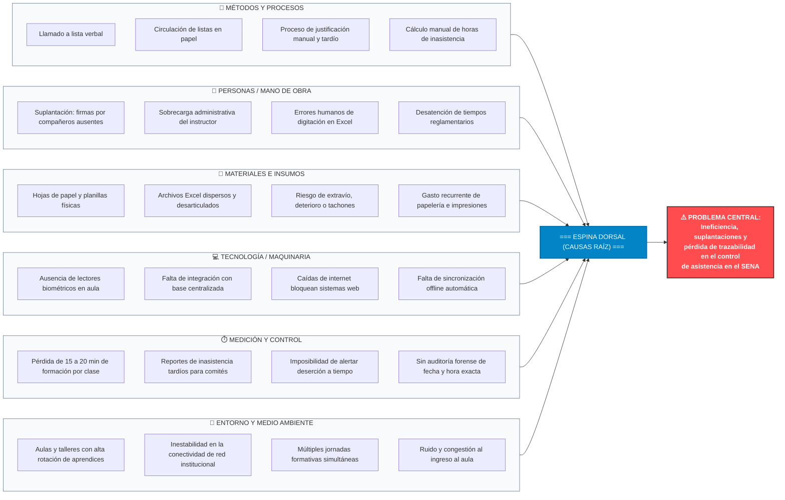

# PLANTEAMIENTO DEL PROBLEMA, DIAGRAMA DE ISHIKAWA Y JUSTIFICACIÓN
## Sistema de Control de Asistencia y Gestión Académica Biométrica (Huellero SENA / Asista)

---

**Institución:** Servicio Nacional de Aprendizaje (SENA)  
**Centro de Formación:** Centro de Servicios y Gestión Empresarial / Formación Tecnológica  
**Proyecto:** Sistema Integral de Control de Asistencia y Gestión Académica Biométrica con Lector DigitalPersona U.are.U 4500  
**Finalidad de este documento:** Proveer el marco conceptual, el árbol de causas-efecto estructurado para diagramación (Espina de Pescado / Ishikawa) y la justificación institucional, técnica y normativa del proyecto.

---

## 1. PLANTEAMIENTO DEL PROBLEMA

### 1.1. Contexto de la Situación Actual
En las instituciones de educación para el trabajo y el desarrollo humano, y puntualmente en el Servicio Nacional de Aprendizaje (SENA), el registro y seguimiento de la asistencia diaria de los aprendices es un elemento crucial para la trazabilidad formativa, la retención estudiantil, la asignación de apoyos de sostenimiento y la aplicación del Reglamento del Aprendiz (Acuerdo 007 de 2012).

Actualmente, en gran parte de los ambientes de aprendizaje, el control de asistencia se lleva a cabo mediante **mecanismos análogos y manuales**: listas de asistencia en hojas de papel firmadas a mano o planillas de cálculo (Excel) diligenciadas individualmente por cada instructor al inicio o término de su jornada formativa.

### 1.2. Síntomas y Problemáticas Identificadas
1. **Pérdida Crítica de Tiempo Formativo:** Los instructores dedican entre 10 y 20 minutos por sesión lectiva llamando a lista de viva voz o circulando hojas de papel. Multiplicado por las jornadas y ambientes del centro, representa cientos de horas docentes desperdiciadas al mes que deberían destinarse a la transferencia de conocimiento.
2. **Suplantación de Identidad y Fraude Académico:** En las listas físicas existe la práctica común de "firmar por el compañero ausente", lo cual vicia la veracidad de los registros y dificulta la detección real del absentismo.
3. **Falta de Trazabilidad y Consolidación Tardía:** Al ser registros aislados en carpetas físicas o archivos personales, la administración y los comités pedagógicos no disponen de información en tiempo real. Los reportes consolidados suelen generarse semanas o meses después, impidiendo la activación oportuna de alertas de deserción temprana.
4. **Vulnerabilidad de los Soportes Físicos:** Las hojas de papel están expuestas a deterioro físico, extravío, manchas, ilegibilidad caligráfica y tachaduras, impidiendo auditorías confiables.
5. **Inconsistencias en el Cálculo de Inasistencias y Sanciones:** El Reglamento del Aprendiz establece causales de deserción por acumulación de inasistencias injustificadas continuas o discontinuas. Con procesos manuales, el cálculo de horas acumuladas es propenso a errores humanos de digitación y sumatorias.
6. **Dependencia de la Conectividad a Internet:** Muchas soluciones digitales comerciales fracasan en las aulas debido a caídas intempestivas de la red WiFi/Ethernet del centro educativo, paralizando el ingreso de los aprendices si el sistema no posee capacidad de operación fuera de línea (*Offline-First*).

### 1.3. Formulación de la Pregunta Problema
> *¿De qué manera un sistema automatizado de control de asistencia biométrico con arquitectura híbrida y capacidad offline-first permite optimizar los tiempos de clase, erradicar la suplantación de aprendices y garantizar la trazabilidad fidedigna de las asistencias en el SENA?*

---

## 2. ANÁLISIS DE LA NECESIDAD: DIAGRAMA DE ISHIKAWA (ESPINA DE PESCADO)

### 2.1. Problema Central (Cabeza del Pescado)
**"Ineficiencia, vulnerabilidad al fraude y falta de trazabilidad en tiempo real en el control de asistencia de los aprendices del SENA."**

---

### 2.2. Diagrama Visual en Mermaid (Listo para Visualizar)

---

### 2.3. Estructura Desglosada para Pasar a Herramientas de Diagramación
*(Usa esta tabla o esquema jerárquico para copiar y pegar directamente en Canva, Miro, Lucidchart, Visio o PowerPoint)*

| Categoría (Espina Principal) | Causas Secundarias | Causas de Tercer Nivel (Efecto Inmediato) |
|---|---|---|
| **1. Métodos y Procesos** | • Llamado a lista manual verbal. • Circulación de hojas de papel para firmas. • Recepción de excusas médicas en papel suelto. • Registro desfasado de novedades horarias. | • Pérdida de foco pedagógico en el aula. • Fácil alteración y falsificación de firmas. • Extravío de soportes médicos válidos. • Desajuste entre horario real y reportado. |
| **2. Personas / Mano de Obra** | • Aprendices cometiendo suplantación ("firmar por otro"). • Carga administrativa excesiva sobre los instructores. • Errores involuntarios al digitar planillas en casa. • Falta de validación inequívoca del asistente. | • Convivencia de aprendices ausentes reportados presentes. • Fatiga y pérdida de tiempo del instructor. • Reportes erróneos enviados a coordinación. • Reclamos y disputas por notas/asistencias. |
| **3. Materiales e Insumos** | • Uso continuo de formatos físicos preimpresos. • Múltiples versiones de archivos Excel desintegrados. • Físicos almacenados en carpetas de archivo tradicionales. • Alto consumo innecesario de papel y tinta. | • Desgaste, manchas o pérdida total del registro. • Inconsistencias al cruzar datos entre fichas. • Imposibilidad de búsqueda indexada rápida. • Impacto ambiental y costos de oficina. |
| **4. Maquinaria y Tecnología** | • Carencia de hardware biométrico ágil en aula. • Dependencia absoluta de conexión a internet activa. • Falta de una base de datos centralizada y segura. • Inexistencia de arquitectura Offline-First. | • No se aprovechan las características biométricas 1:N. • El sistema se "cae" cuando el WiFi institucional falla. • Información fragmentada por cada computador docente. • Imposibilidad de registrar ingresos sin internet. |
| **5. Medición y Control** | • Pérdida de 15 a 20 minutos de formación por clase. • Monitoreo de inasistencia diferido (quincenal o mensual). • Conteo manual de horas acumuladas de falta. • Ausencia de marcas temporales forenses. | • Reducción del cumplimiento curricular lectivo. • Comités de evaluación citados demasiado tarde. • Errores en aplicación de deserción (Reglamento Aprendiz). • Dificultad para demostrar la hora exacta de ingreso. |
| **6. Entorno y Medio Ambiente** | • Aulas y talleres con alta afluencia y rotación. • Infraestructura de red inestable o intermitente. • Múltiples jornadas (mañana, tarde, noche, madrugada). • Aglomeración en la puerta al registrarse. | • Interrupciones constantes en el ingreso al aula. • Desconexión de servicios en la nube. • Complejidad para auditar turnos mixtos. • Distracción y desorden en el ambiente de aprendizaje. |

---

## 3. JUSTIFICACIÓN DEL PROYECTO

### 3.1. Justificación Operativa y Pedagógica
* **Recuperación del Tiempo Formativo:** La verificación biométrica mediante el lector **DigitalPersona U.are.U 4500** y su motor 1:N en memoria permite registrar la presencia de un aprendiz en **menos de 1 segundo**, reduciendo el proceso de 20 minutos a escasos 1 o 2 minutos para un grupo completo de 30 o 40 aprendices.
* **Cero Suplantación:** La huella dactilar es un rasgo biométrico intransferible e irreproducible en tiempo real, erradicando al 100% la práctica de firmar por compañeros ausentes.
* **Alivio de la Carga Docente:** El instructor queda liberado de tareas rutinarias de conteo, transcripción de planillas y llamadas a lista, concentrándose exclusivamente en la transferencia técnica y el acompañamiento formativo.

### 3.2. Justificación Técnica y de Arquitectura
* **Operación Continua sin Internet (*Offline-First* con SQLite):** Gracias a su diseño desktop en **Electron**, el aplicativo almacena las minucias y registra las asistencias localmente en una base de datos SQLite cifrada. Si la sede sufre cortes de luz o de internet, la toma de asistencia continúa con normalidad y se sincroniza automáticamente con **MongoDB Atlas** cuando la conexión se restablece.
* **Identificación Automática 1:N en Memoria:** El aprendiz no necesita digitar su número de documento ni interactuar con pantallas touch. Solo coloca su dedo sobre el sensor; el sistema extrae la plantilla (*template* ISO/IEC 19794-2) y la compara contra toda la lista activa en memoria en milisegundos.
* **Transparencia en Tiempo Real (WebSockets):** Monitoreo en vivo de los aprendices que ingresan a clase, con indicadores visuales claros (a tiempo, retardo, inasistencia o excusa justificada).

### 3.3. Justificación Legal, Normativa y de Seguridad de Datos
* **Ley 1581 de 2012 (Habeas Data de Colombia):** Los datos biométricos tienen carácter de datos sensibles. El sistema cumple estrictamente con el principio de seguridad y finalidad, pues **no almacena ni transmite imágenes ni fotografías de huellas**, sino vectores matemáticos unidireccionales (*minucias cifradas*), imposibles de reconstruir visualmente hacia la huella original.
* **Aplicación Fiel del Reglamento del Aprendiz (Acuerdo 007 de 2012):** Automatiza el cálculo exacto de las horas acumuladas de inasistencia injustificada y las horas de retardo, proporcionando a los coordinadores académicos y comités de evaluación reportes auditables e indiscutibles para los procesos de plan de mejoramiento o cancelación de matrícula.

### 3.4. Justificación Institucional y Económica
* **Cero Consumo de Papelería:** Se suprime el gasto continuo en resmas de papel, impresiones, tóner y carpetas de archivo, alineándose con las políticas de cero papel y sostenibilidad ambiental del Gobierno Nacional y del SENA.
* **Detección Temprana y Mitigación de la Deserción:** Al disponer de un panel con alertas preventivas cuando un aprendiz acumula inasistencias en tiempo real, los instructores y el área de Bienestar al Aprendiz pueden intervenir a tiempo antes de que el aprendiz abandone su formación.

---

## 4. RESUMEN EJECUTIVO (GUÍA PARA PRESENTACIÓN / SUSTENTACIÓN)

| Aspecto | Resumen Clave |
|---|---|
| **Problema:** | Pérdida de hasta 20 min de clase, suplantación de identidad entre aprendices, deterioro de listas físicas e imposibilidad de detectar la deserción a tiempo. |
| **Causa Raíz:** | Dependencia de procesos análogos en papel, falta de biometría en aula y ausencia de sistemas híbridos capaces de operar sin internet. |
| **Solución:** | Sistema automatizado con lector biométrico DigitalPersona U.are.U 4500, motor de búsqueda 1:N en memoria, arquitectura Electron + Vue 3 + Node.js, almacenamiento SQLite local y sincronización diferida a MongoDB Atlas. |
| **Beneficios:** | Marcación en 1 segundo por aprendiz, eliminación total de la suplantación, disponibilidad 100% aun sin internet, trazabilidad legal bajo la Ley 1581 y alertas automáticas para el Reglamento del Aprendiz. |
