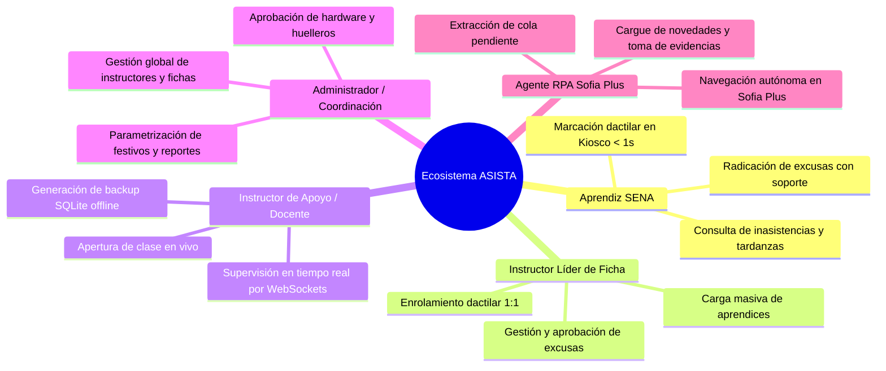
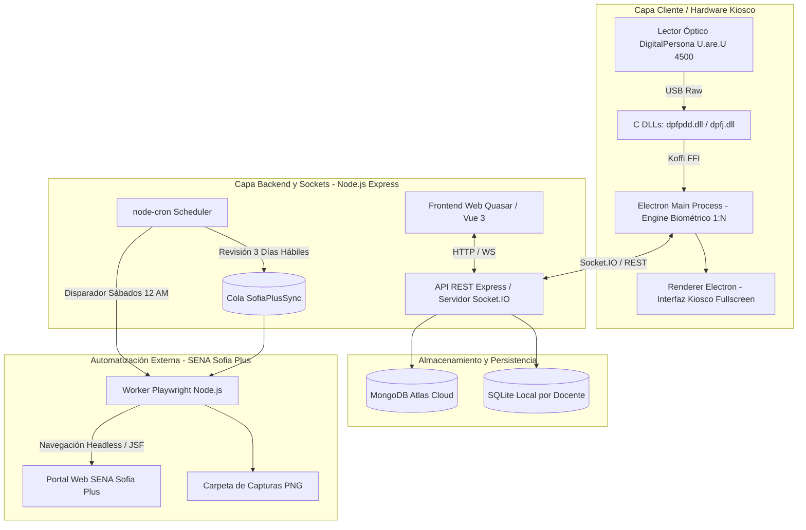
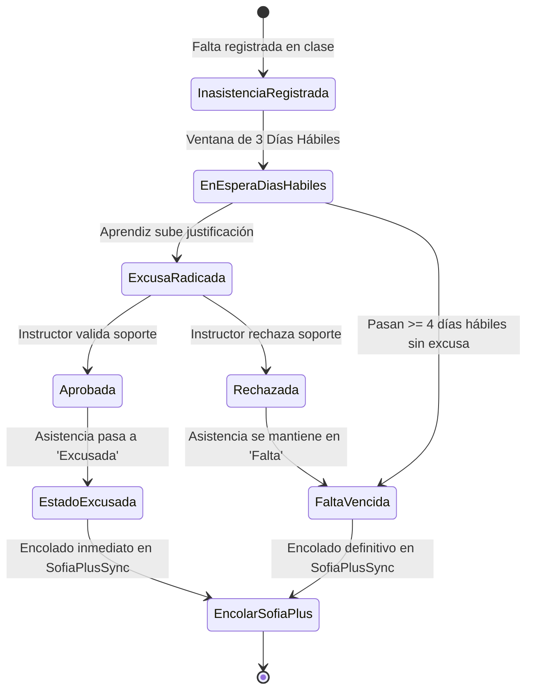
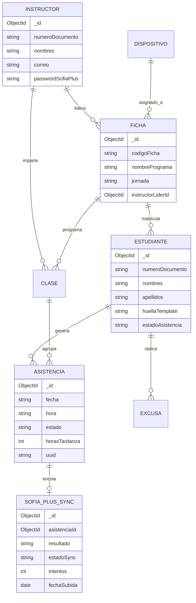
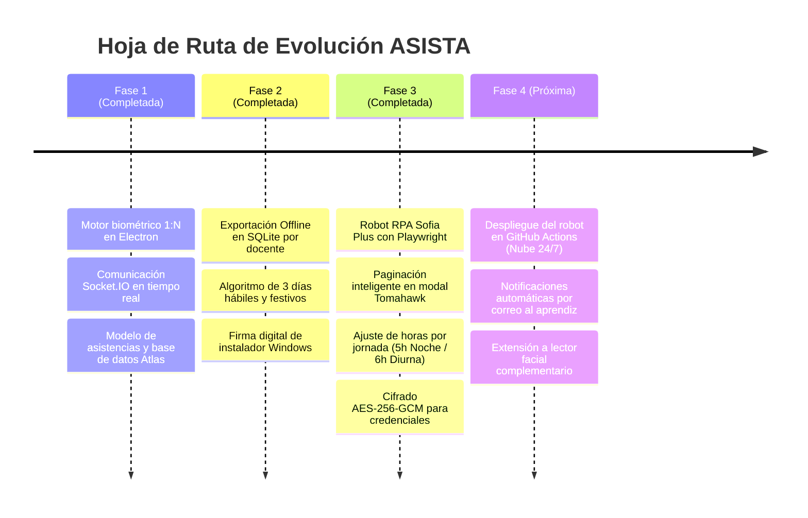

# 📄 DOCUMENTO DE REQUISITOS DEL PRODUCTO (PRD)
## Sistema Integral de Control de Asistencia Biométrico y Gestión Académica (ASISTA / Huellero SENA)

---

**Entidad:** Servicio Nacional de Aprendizaje (SENA)  
**Proyecto:** ASISTA (Sistema Automatizado de Asistencia y Novedades Biométricas)  
**Versión del Producto:** 2.5 (Release Candidate)  
**Fecha:** Octubre de 2026  
**Estado:** En Producción / Pruebas Piloto de Campo  
**Autor Principal:** Juan Camilo Viviescas  
**Equipo de Desarrollo:** Juan Camilo Viviescas, María Juliana Saavedra, César Augusto, Óscar Andrés Arenas, Iván René Figueroa  

---

## 📑 TABLA DE CONTENIDO
1. [Resumen Ejecutivo y Visión del Producto](#1-resumen-ejecutivo-y-visión-del-producto)
2. [Planteamiento del Problema y Justificación de Negocio](#2-planteamiento-del-problema-y-justificación-de-negocio)
3. [Personas de Usuario y Stakeholders](#3-personas-de-usuario-y-stakeholders)
4. [Arquitectura General y Diagramas de Flujo](#4-arquitectura-general-y-diagramas-de-flujo)
5. [Requisitos Funcionales (RF) por Módulos y Épicas](#5-requisitos-funcionales-rf-por-módulos-y-épicas)
   - [Épica 1: Hardware Biométrico y Cliente Desktop (Huellero)](#épica-1-hardware-biométrico-y-cliente-desktop-huellero)
   - [Épica 2: Control de Asistencia y Monitoreo en Vivo (WebSockets)](#épica-2-control-de-asistencia-y-monitoreo-en-vivo-websockets)
   - [Épica 3: Gestión Académica Institucional (Fichas, Usuarios, Calendario)](#épica-3-gestión-académica-institucional-fichas-usuarios-calendario)
   - [Épica 4: Módulo de Excusas, Justificaciones y Ventana Legal](#épica-4-módulo-de-excusas-justificaciones-y-ventana-legal)
   - [Épica 5: Automatización RPA y Sincronización con SENA Sofia Plus](#épica-5-automatización-rpa-y-sincronización-con-sena-sofia-plus)
   - [Épica 6: Arquitectura Offline-First y Resiliencia en Red](#épica-6-arquitectura-offline-first-y-resiliencia-en-red)
   - [Épica 7: Seguridad, Criptografía y Protección de Datos (Habeas Data)](#épica-7-seguridad-criptografía-y-protección-de-datos-habeas-data)
6. [Requisitos No Funcionales (RNF)](#6-requisitos-no-funcionales-rnf)
7. [Modelo de Datos y Ciclos de Vida](#7-modelo-de-datos-y-ciclos-de-vida)
8. [Métricas de Éxito e Indicadores Clave (KPIs)](#8-métricas-de-éxito-e-indicadores-clave-kpis)
9. [Matriz de Riesgos y Mitigaciones](#9-matriz-de-riesgos-y-mitigaciones)
10. [Hoja de Ruta y Próximos Pasos (Roadmap)](#10-hoja-de-ruta-y-próximos-pasos-roadmap)

---

## 1. RESUMEN EJECUTIVO Y VISIÓN DEL PRODUCTO

### 1.1. Visión del Producto
Proporcionar a los Centros de Formación del SENA una plataforma unificada, biométrica, autónoma y resiliente (*Offline-First*) que automatice el 100% del ciclo de vida de la asistencia formativa: desde la identificación dactilar instantánea del aprendiz en el aula mediante hardware óptico, hasta el cargue desatendido de fallas en la plataforma institucional **SENA Sofia Plus** mediante robots de automatización de procesos (RPA).

### 1.2. Propuesta de Valor
* **Cero Suplantación / Cero Fraude:** Sustitución de listas de papel o firmas manuales por comparación biométrica en memoria 1:N utilizando lectores ópticos DigitalPersona U.are.U 4500.
* **Ahorro de Tiempo Docente (95%):** Los instructores no invierten tiempo de su clase llamando a lista ni dedicando sus fines de semana a radicar inasistencias en el portal web de Sofia Plus.
* **Garantía del Reglamento del Aprendiz:** Cálculo matemático automatizado de escalas de tardanza (1h, 2h), banco de horas acumuladas adaptativo según la jornada formativa (5 horas en Noche, 6 horas en Mañana/Tarde) y alertas tempranas de deserción.
* **Resiliencia Operativa Continua:** Capacidad de operar sin conexión a internet en ambientes cerrados del SENA gracias a bases de datos SQLite locales y sincronización diferida con MongoDB Atlas.

---

## 2. PLANTEAMIENTO DEL PROBLEMA Y JUSTIFICACIÓN DE NEGOCIO

### 2.1. Diagnóstico de la Situación Actual en el SENA
1. **Pérdida Crítica de Tiempo Formativo:** Los instructores dedican entre 15 y 20 minutos por bloque de formación a pasar lista de forma manual en planillas físicas o archivos Excel.
2. **Vulnerabilidad a la Suplantación:** En planillas físicas o llamadas verbales, es frecuente la firma por compañeros o el reporte no fidedigno de la hora de ingreso real.
3. **Complejidad y Desgaste en Sofia Plus:**
   - La plataforma Sofia Plus opera sobre arquitectura JSF / Apache MyFaces con sesiones cortas de 10 minutos que se desconectan frecuentemente.
   - Cada novedad requiere abrir múltiples ventanas modales, paginar listas de aprendices y seleccionar manualmente fecha, hora y justificación por cada inasistencia.
   - Los instructores terminan acumulando semanas de fallas sin reportar por la fatiga del trámite manual, lo que dificulta citar a comités de evaluación en los plazos legales.
4. **Fallas Frecuentes de Conectividad:** La infraestructura de red de los centros de formación sufre caídas intermitentes o bloqueos por proxies corporativos, impidiendo soluciones 100% dependientes de la nube durante el inicio de clases.

---

## 3. PERSONAS DE USUARIO Y STAKEHOLDERS

### 3.1. Perfiles de Usuario

| Rol | Descripción | Objetivos Clave en el Sistema |
|---|---|---|
| **Aprendiz SENA** | Estudiante matriculado en una ficha de formación titulada o complementaria. | Registrar su ingreso colocando el dedo en el sensor en menos de 1 segundo; consultar su estado disciplinario y justificar fallas en los 3 días hábiles legales. |
| **Instructor Líder** | Docente responsable principal de la ficha académica y su seguimiento integral. | Enrolar las huellas de su grupo, aprobar o rechazar excusas médicas/laborales, configurar credenciales de Sofia Plus con cifrado de grado militar. |
| **Instructor de Apoyo** | Docente que imparte competencias técnicas específicas a la ficha. | Iniciar la sesión de clase con un clic, ver el ingreso de aprendices en vivo en pantalla y descargar la base de datos SQLite para trabajar desconectado. |
| **Administrador** | Coordinador académico o líder de área TIC del centro de formación. | Registrar docentes, vincular huelleros aprobados por dirección MAC/huella de hardware, registrar días festivos y auditar el historial de sincronizaciones. |
| **Agente RPA Autónomo** | Proceso desatendido basado en Playwright y Node.js. | Leer la cola `sofiaplus_sync`, autenticarse en Sofia Plus los sábados a las 12:00 AM, buscar fichas y alumnos mediante paginación DOM y radicar las inasistencias. |

---

## 4. ARQUITECTURA GENERAL Y DIAGRAMAS DE FLUJO

### 4.1. Diagrama de Arquitectura de la Solución

---

## 5. REQUISITOS FUNCIONALES (RF) POR MÓDULOS Y ÉPICAS

### Épica 1: Hardware Biométrico y Cliente Desktop (Huellero)

* **RF-BIO-01 (Identificación 1:N en Memoria):** El lector debe permitir la marcación sin solicitar cédula previa. Al posar el dedo, el motor biométrico comparará la plantilla contra todas las minucias activas de la ficha en memoria RAM en menos de 1000 ms.
* **RF-BIO-02 (Validación Preventiva de Duplicados):** Durante el enrolamiento de un aprendiz, el sistema debe contrastar la nueva huella capturada contra todas las huellas previamente registradas en la base de datos. Si la similitud supera el umbral FMR de coincidencia, se rechazará el enrolamiento notificando: *"Esta huella ya pertenece al aprendiz [Nombre]"*.
* **RF-BIO-03 (Reconexión en Caliente de Hardware):** Si el cable USB del sensor es desconectado o suspendido por el sistema operativo (`HARDWARE_MISMATCH`), el proceso principal de Electron debe re-inicializar el contexto del SDK nativo (`dpfpdd_init`) sin requerir reiniciar la aplicación.
* **RF-BIO-04 (Protección Kiosco y Firma Digital):** La aplicación de escritorio debe contar con instalador firmado mediante certificado digital institucional SENA (`.cer`), suprimiendo advertencias de Windows SmartScreen y operando en modo Kiosco a pantalla completa para evitar manipulaciones ajenas.

---

### Épica 2: Control de Asistencia y Monitoreo en Vivo (WebSockets)

* **RF-ASI-01 (Apertura y Cierre de Sesión de Clase):** El instructor asignado podrá activar una clase vinculada a su ficha. Los kioscos físicos autorizados cargarán inmediatamente las huellas de dicha ficha en memoria.
* **RF-ASI-02 (Actualización Reactiva por WebSockets):** Cada marcación dactilar debe reflejarse instantáneamente (< 200 ms) en el panel del instructor conectado mediante eventos Socket.IO en la sala de la ficha.
* **RF-ASI-03 (Auto-Cierre Preventivo de 3 Horas):** Un job cron en segundo plano evaluará cada 60 segundos las clases activas. Toda clase cuya hora de inicio supere los 180 minutos (3 horas) será cerrada automáticamente con el motivo `AUTO_CIERRE_3_HORAS`, garantizando que las fallas de aprendices ausentes se calculen formalmente.
* **RF-ASI-04 (Escala Escalonada de Tardanzas):**
  - **Minuto 0 a 15:** `Presente` (Tolerancia institucional).
  - **Minuto 16 a 60:** `Tardanza` (1 hora penalizada).
  - **Minuto 61 a 120:** `Tardanza` (2 horas penalizadas).
  - **Más de 120 minutos o sin marcación:** `Falta` (Inasistencia a jornada completa).
* **RF-ASI-05 (Banco de Tardanzas Adaptativo por Jornada):**
  - **Jornada Noche:** La sesión lectiva equivale a **5 horas**. La acumulación de 5 horas de tardanza se computará automáticamente como 1 día de inasistencia (`Math.floor(horas / 5)`).
  - **Jornadas Mañana y Tarde:** La sesión lectiva equivale a **6 horas**. La acumulación de 6 horas de tardanza equivaldrá a 1 día de inasistencia (`Math.floor(horas / 6)`).
* **RF-ASI-06 (Alertas de Criticidad y Deserción):** El sistema marcará a un aprendiz en estado `CRÍTICO` cuando acumule $\ge 3$ inasistencias consecutivas o $\ge 5$ inasistencias totales en el periodo, emitiendo alertas directas para citación a comité de evaluación.

---

### Épica 3: Gestión Académica Institucional (Fichas, Usuarios, Calendario)

* **RF-ACA-01 (Gestión Integral de Fichas):** Creación y edición de fichas con campos: código, nombre del programa, jornada (`Mañana`, `Tarde`, `Noche`), aula asignada, instructor líder y lista de instructores de apoyo.
* **RF-ACA-02 (Carga Masiva de Aprendices):** Importación de listas mediante archivos Excel (`.xlsx`) y CSV con validación de duplicidad por documento y estructura de datos.
* **RF-ACA-03 (Calendario de Días Festivos y No Lectivos):** Módulo de parametrización de días festivos oficiales de Colombia y fechas de receso institucional, excluyéndolos de los cálculos de inasistencias y plazos de excusa.

---

### Épica 4: Módulo de Excusas, Justificaciones y Ventana Legal

* **RF-EXC-01 (Ventana Legal de 3 Días Hábiles):** El aprendiz dispone de exactamente 3 días hábiles completos tras la inasistencia para radicar su justificación.
  - Para jornadas diurnas: Días hábiles = Lunes a Viernes (omitiendo festivos y fines de semana).
  - Para jornadas nocturnas: Los sábados se consideran días hábiles lectivos.
* **RF-EXC-02 (Aprobación y Efecto Inmediato):** Al ser aprobada una excusa por el instructor, el estado de la asistencia cambia de `Falta` a `Excusada`, las horas de penalización vuelven a cero y la novedad se encola inmediatamente para su reporte en Sofia Plus.

---

### Épica 5: Automatización RPA y Sincronización con SENA Sofia Plus

* **RF-RPA-01 (Programación Semanal Sabatina):** El proceso de sincronización con Sofia Plus se ejecutará automáticamente **todos los sábados a las 12:00 AM (medianoche)** (`CRON_SOFIA_SCHEDULE = '0 0 * * 6'`, hora de Colombia).
* **RF-RPA-02 (Colección de Cola SofiaPlusSync):** Las inasistencias se almacenan en la colección `sofiaplus_sync` con estados `pendiente`, `subido` y `error`.
  - Las faltas injustificadas solo se encolan si han transcurrido $\ge 4$ días hábiles (garantizando que el plazo de 3 días hábiles concluyó por completo).
  - Las faltas excusadas se encolan de forma inmediata.
* **RF-RPA-03 (Orquestador Multi-Docente Desatendido):** El robot Playwright iterará automáticamente:
  $$\text{Docente por Docente} \;\longrightarrow\; \text{Ficha por Ficha} \;\longrightarrow\; \text{Aprendiz por Aprendiz}$$
* **RF-RPA-04 (Autenticación Segura y Cifrado AES-256-GCM):** El robot recupera las credenciales del instructor desde el backend descifradas al vuelo mediante AES-256-GCM, realiza el login en Sofia Plus, salta alertas modales y cambia automáticamente el rol a *"Instructor"*.
* **RF-RPA-05 (Navegación y Optimización DOM en Sofia Plus):**
  - **Fichas:** El robot verifica el contenido del formulario antes de abrir ventanas modales para no saturar el servidor JSF.
  - **Paginación Inteligente de Aprendices:** Si un aprendiz no aparece en la primera página de la ficha en el modal `viewDialog1_content`, el bot presiona el paginador Tomahawk `[id='form2:dsListasnext']` hasta localizarlo.
* **RF-RPA-06 (Discriminación Precisa de Horas en Sofia Plus):**
  - Si la ficha es de **Jornada Noche**: el robot diligencia **5 horas** en el campo `formNovedadAprendiz:horasITX`.
  - Si la ficha es de **Jornadas Mañana o Tarde**: el robot diligencia **6 horas**.
* **RF-RPA-07 (Estandarización Limpia de Justificación):** El texto ingresado en el campo de justificación se estandariza sin fechas redundantes:
  - Faltas: `"Falla injustificada"`.
  - Excusadas: `"Falla justificada"`.
  - Tardanzas: `"Tardanza injustificada"`.
* **RF-RPA-08 (Modo Seguro / Dry-Run y Evidencias):** Por defecto, el bot opera en modo `--dry-run` (diligencia campos en pantalla y toma foto PNG sin presionar el botón de registro final). Solo al incluir la bandera explícita `--confirmar-registro` se envía la transacción al portal institucional.

---

### Épica 6: Arquitectura Offline-First y Resiliencia en Red

* **RF-OFF-01 (Exportación Nocturna a SQLite):** Todas las noches a las 00:00 horas, el backend genera y actualiza un archivo de base de datos local SQLite (`.db`) independiente por cada instructor en `backend/data/{documentoDocente}_asistencias.db`.
* **RF-OFF-02 (Sincronización Bidireccional Idempotente):** Toda marcación dactilar genera un identificador único universal (`uuid`). Al reanudarse la conectividad, las asistencias almacenadas localmente se sincronizan con MongoDB Atlas sin generar duplicados.

---

### Épica 7: Seguridad, Criptografía y Protección de Datos (Habeas Data)

* **RF-SEG-01 (Cumplimiento Ley 1581 de 2012 - Habeas Data):** Queda estrictamente prohibido almacenar imágenes de huellas dactilares (BMP, PNG, JPG). El sistema únicamente almacena vectores de minucias ISO/IEC 19794-2 (hashes matemáticos unidireccionales), de los cuales es matemáticamente imposible reconstruir la huella física.
* **RF-SEG-02 (Cifrado Simétrico AES-256-GCM para Contraseñas Sofia Plus):** Las contraseñas de instructores para acceso al portal SENA se cifran con clave maestra institucional, Vector de Inicialización (IV) de 12 bytes y Etiqueta de Autenticación (Auth Tag) de 16 bytes, evitando ataques de repetición o manipulación en reposo.
* **RF-SEG-03 (Tokens de Control de Dispositivos por Hardware):** Todo huellero físico se valida mediante un hash criptográfico SHA-256 de su hardware y una clave precompartida con el servidor central.

---

## 6. REQUISITOS NO FUNCIONALES (RNF)

| Identificador | Categoría | Requisito / Criterio de Aceptación |
|---|---|---|
| **RNF-001** | **Rendimiento Biométrico** | El tiempo de identificación 1:N en memoria debe ser $\le 1000\text{ ms}$ para fichas de hasta 40 aprendices. |
| **RNF-002** | **Latencia de WebSockets** | La propagación de la marcación física a la interfaz web del instructor debe completarse en $\le 250\text{ ms}$. |
| **RNF-003** | **Disponibilidad Offline** | La aplicación de escritorio debe permitir la toma de asistencia al 100% aun cuando no exista conexión a internet o el servidor central esté caído. |
| **RNF-004** | **Compatibilidad de Hardware** | Soporte estricto para lectores DigitalPersona U.are.U 4500 bajo sistemas operativos Windows 10 y Windows 11 de 64 bits. |
| **RNF-005** | **Seguridad en Reposo** | Todas las credenciales externas deben almacenarse bajo cifrado autenticado AES-256-GCM; las contraseñas de usuarios bajo hash `bcrypt` (10 rondas de sal). |
| **RNF-006** | **Tasa de Error Biométrico** | La Tasa de Falsa Aceptación (FAR) del motor biométrico debe configurarse en $1/100.000$ ($0.001\%$), priorizando la seguridad ante falsos positivos. |
| **RNF-007** | **Tolerancia a Fallos en RPA** | El robot Sofia Plus debe implementar backoff exponencial y pausa de 5 minutos ante errores 500 de Sofia Plus para prevenir el bloqueo de la cuenta del docente. |
| **RNF-008** | **Usabilidad y Accesibilidad** | La interfaz web debe cumplir estándares de contraste WCAG AA (mínimo 4.5:1) y diseño responsivo para tablets de instructores y pantallas de Kiosco. |

---

## 7. MODELO DE DATOS Y CICLOS DE VIDA

### 7.1. Diagrama Entidad-Relación Conceptual

---

## 8. MÉTRICAS DE ÉXITO E INDICADORES CLAVE (KPIS)

1. **Eficiencia en Registro de Asistencia:**
   - *Meta:* Reducir el tiempo promedio de marcación por grupo (30 aprendices) de **18 minutos** (manual) a **menos de 45 segundos** (biométrico).
2. **Exactitud y Cero Fraude:**
   - *Meta:* 0% de casos de suplantación registrados en las fichas piloto que cuentan con huellero biométrico.
3. **Puntualidad en Reportes a Sofia Plus:**
   - *Meta:* 100% de inasistencias vencidas radicadas en Sofia Plus antes de cumplirse 7 días calendario del hecho.
4. **Reducción de Carga Operativa Docente:**
   - *Meta:* Disminución del 95% de las horas hombre invertidas por instructores en digitación manual de novedades en Sofia Plus los fines de semana.
5. **Continuidad Operativa:**
   - *Meta:* 0 pérdidas de información por caídas de internet gracias a la arquitectura de backup en SQLite.

---

## 9. MATRIZ DE RIESGOS Y MITIGACIONES

| Riesgo Identificado | Impacto | Probabilidad | Estrategia de Mitigación Implementada |
|---|:---:|:---:|---|
| **Caídas frecuentes o mantenimiento del portal Sofia Plus** | Alto | Alta | El robot RPA detecta errores 5xx o pantallas de caída, aborta la transacción sin quemar credenciales, reintenta en la siguiente iteración y preserva la cola en estado `pendiente`. |
| **Bloqueo de cuentas por contraseñas erróneas** | Crítico | Media | El robot valida el mensaje de error de login en pantalla; si detecta error de credenciales, detiene inmediatamente el proceso del docente y envía alerta por WebSocket al panel. |
| **Fallas en la red Wi-Fi del aula de clases** | Alto | Alta | Almacenamiento local en SQLite y memoria de Electron. La marcación dactilar nunca se interrumpe y los datos se sincronizan al recuperar conexión. |
| **Daño físico o descalibración del lector óptico** | Medio | Baja | El sistema incluye módulo de marcación manual asistida con registro obligatorio de justificación para casos excepcionales de daño de hardware o heridas en dedos. |

---

## 10. HOJA DE RUTA Y PRÓXIMOS PASOS (ROADMAP)

---

> **Aprobación del Documento:**  
> Documento técnico de especificación y requerimientos de producto elaborado para evaluación institucional, validación por coordinación académica y entrega de proyecto formativo en el Servicio Nacional de Aprendizaje (SENA).
